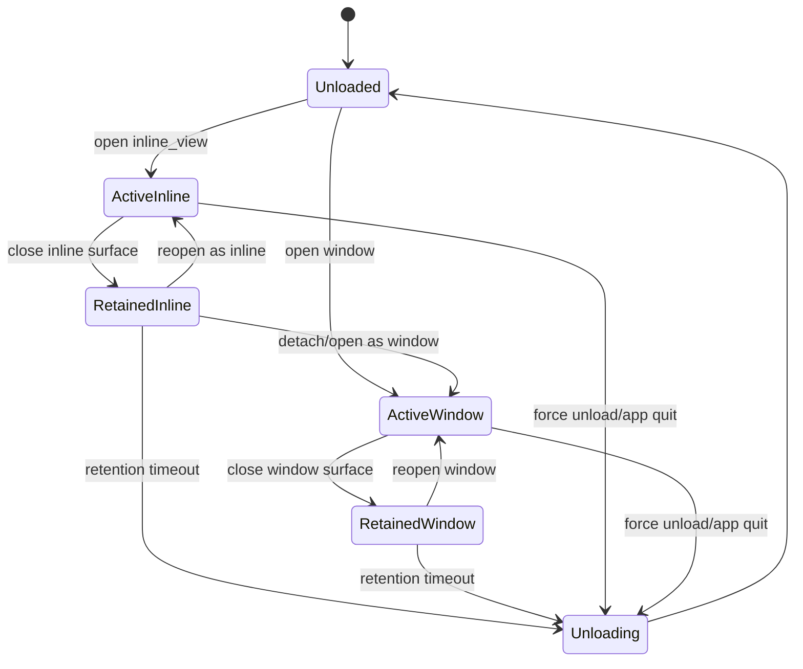

# 插件会话保留与独立窗口承载设计

本文档面向后续实现，描述如何改造当前 PySide6 + QML 插件生命周期，使独立窗口插件和内联插件在关闭 UI 后保留 5 分钟，5 分钟内再次唤醒时复用原会话并尽量保留原状态。同时支持内联插件切换到独立窗口承载，且独立窗口不再被全局 Esc 关闭。

## 1. 需求范围

### 1.1 目标行为

1. 独立窗口插件关闭后，不立即销毁 `PluginSession`、ViewModel 和 Runtime。
2. 内联插件退出后，不立即销毁 `PluginSession`、ViewModel 和 Runtime。
3. 默认保留时间为 5 分钟，即 300000 ms。
4. 保留期内再次启动同一插件时，取消卸载计时并恢复上一次会话。
5. 保留期满后，如果插件没有再次被唤醒，才执行真正卸载。
6. 内联插件可以从 Launcher 内联区域切换到独立窗口承载。
7. 独立窗口插件不再响应窗口根级 Esc 关闭，只能通过窗口关闭按钮或明确关闭动作关闭。
8. 应用退出、重启、热重载强制刷新时仍然立即清理资源，不等待 5 分钟。

### 1.2 非目标行为

1. `launchMode: "none"` 的即时命令不进入 5 分钟保留逻辑。
2. `launchMode: "list"` 暂不要求完整 QML 状态保留，因为它没有自定义 QML 页面；可只保留会话模型，或沿用当前即时关闭策略。
3. 后台插件不受本设计影响，仍由 `BackgroundManager` 管理。
4. 本设计不要求把所有插件状态持久化到磁盘。5 分钟内状态保留主要依赖内存中的会话和界面对象。
5. 当前实现中 `_plugin_windows` 以 `plugin_id` 作为 key，天然偏单实例。本设计先覆盖单实例插件；多实例窗口需要单独引入 `session_id` 后再完整支持。

## 2. 当前实现现状

### 2.1 会话打开

当前 `src/app/plugins/session_manager.py` 中 `PluginSessionManager.open_plugin()` 每次打开插件时都会先调用：

```python
self.close_plugin(plugin_id)
```

这会导致同一插件每次启动都销毁旧会话，再创建新会话。用户在 ViewModel 中的临时状态会丢失。

### 2.2 会话关闭

当前 `close_plugin()` 做了三件事：

1. 从 `_sessions` 移除会话。
2. 将 manifest 的 `contextProperty` 设置为 `None`。
3. 调用 `session.close()` 和 `plugin_manager.close_runtime(plugin_id)`。

这表示“关闭 UI”和“真正卸载插件”是同一件事，没有中间保留态。

### 2.3 内联插件退出

当前 `src/app/launcher/LauncherWindow.qml` 的 `exitMixedMode()` 会：

1. 清空当前插件 id。
2. 将 `mixedLoader.active = false`。
3. 调用 `launcherBridge.closePlugin(closingPluginId)`。

`Loader.active = false` 会销毁 QML 页面实例。随后 Python 侧又会关闭 Session 和 Runtime，因此 ViewModel 状态也会丢失。

### 2.4 独立窗口关闭

当前 `src/app/launcher/PluginWindow.qml` 有根级 Esc 关闭逻辑：

```qml
Keys.onEscapePressed: function(event) {
    pluginWin.close()
    event.accepted = true
}
```

Python 侧 `_open_independent_window()` 连接了：

```python
win.closing.connect(_on_closed)
```

`_on_closed()` 会从 `_plugin_windows` 移除窗口并调用 `session_mgr.close_plugin(plugin_id)`。所以独立窗口关闭会立即销毁会话。

## 3. 核心设计原则

### 3.1 分离 UI 关闭和插件卸载

后续代码中要明确区分两个动作：

- 关闭承载面：隐藏 Launcher 内联区域、隐藏独立窗口、退出当前可见交互。
- 卸载会话：调用 `session.close()`、删除 ViewModel、清空 QML context property、调用 `runtime.on_exit()`。

用户按 Esc 退出内联模式、点击独立窗口关闭按钮，只应该触发“关闭承载面 + 进入保留态”。只有保留计时到期、应用退出、显式强制关闭时，才触发“卸载会话”。

### 3.2 Session 是状态保留的主对象

5 分钟内恢复的核心是保留 `PluginSession` 和其 ViewModel。插件业务状态应该优先放在 ViewModel 或 Service 中，而不是只放在 QML 局部变量里。

QML 页面内部的纯 UI 状态分两类处理：

- 独立窗口：推荐关闭时隐藏窗口对象，不销毁 `PluginWindow` 和 `Loader`，因此 QML 页面局部状态也能保留。
- 内联插件：推荐新增内联承载缓存，使内联 QML 页面在保留期内可以隐藏但不销毁。若第一阶段实现复杂，可以先保留 Session 和 ViewModel，重新进入时重建 QML 页面；这种方案只能保证 ViewModel 状态，不能保证 QML 局部状态。

### 3.3 宿主模式和启动模式解耦

`launchMode` 是默认启动方式，不应该永久限制插件承载方式。

例如：

- `launchMode: "inline_view"` 表示默认在 Launcher 内联区打开。
- 用户点击“独立窗口”后，同一 Session 可以切换到 `window` 宿主。
- 以后也可以支持从独立窗口回到内联区，但本需求只要求内联转独立窗口。

### 3.4 保留计时由内核统一管理

不要让各插件自己维护 5 分钟 Timer。内核应统一管理保留状态，避免插件实现不一致。

建议保留时间常量：

```python
PLUGIN_SESSION_RETENTION_MS = 300_000
```

开发调试时可选支持环境变量：

```powershell
$env:PY_DESKTOP_PLUGIN_RETENTION_MS="10000"
```

## 4. 生命周期状态机

### 4.1 状态定义



### 4.2 状态语义

`Unloaded`

插件没有活动 Session。Runtime 也应处于未加载状态，除非它是后台插件。

`ActiveInline`

插件当前显示在 Launcher 内联区域。保留计时停止。

`ActiveWindow`

插件当前显示在独立窗口。保留计时停止。

`RetainedInline`

插件不再显示在 Launcher 中，但 Session 和 ViewModel 仍在内存中。推荐内联 QML host 也保持隐藏状态，直到保留期满。

`RetainedWindow`

用户关闭了独立窗口，但窗口对象被隐藏而不是销毁。Session、ViewModel、QML 页面实例仍在内存中。

`Unloading`

进入真正清理阶段。清理顺序建议为：先销毁可视承载对象，再关闭 Session，最后按需关闭 Runtime。

## 5. 数据结构设计

### 5.1 会话记录

建议在 `PluginSessionManager` 中引入会话记录对象，替代单纯的 `dict[str, PluginSession]`。

```python
@dataclass
class ManagedPluginSession:
    plugin_id: str
    session: PluginSession
    launch_mode: LaunchMode
    state: Literal[
        "active_inline",
        "active_window",
        "retained_inline",
        "retained_window",
    ]
    context_names: set[str]
    retain_timer: QTimer | None = None
    last_command_id: str = ""
    last_input_text: str = ""
    last_payload: dict = field(default_factory=dict)
```

`context_names` 用于真正卸载时清空 QML context property。当前每个 manifest 通常只有一个 `contextProperty`，但保留集合可以让未来扩展更自然。

### 5.2 承载面记录

`main.py` 里当前只有：

```python
_plugin_windows: dict[str, QObject] = {}
```

建议改为更明确的窗口记录：

```python
@dataclass
class PluginWindowSurface:
    plugin_id: str
    window: QObject
    qml_page: str
    hidden_for_retention: bool = False
```

内联承载面如果由 QML 管理，Python 侧可以只保留状态；如果后续抽象更完整，可以新增 `PluginSurfaceManager` 管理 window 和 inline 两类 surface。

### 5.3 会话 key

第一阶段使用 `plugin_id` 作为 session key：

```python
session_key = plugin_id
```

当实现 `window_options.multiInstance: true` 时，应改为：

```python
session_key = f"{plugin_id}:{uuid}"
```

同时 Launcher、Bridge、Window 都要传递 `sessionKey`，不能只传 `pluginId`。本设计先不展开多实例实现。

## 6. PluginSessionManager 改造设计

### 6.1 方法语义调整

建议把现有 `close_plugin()` 拆成三个语义明确的方法：

```python
def suspend_plugin(self, plugin_id: str, host: str) -> None:
    """关闭当前 UI 承载面，进入 5 分钟保留态。"""

def unload_plugin(self, plugin_id: str) -> None:
    """立即真正卸载 Session 和 Runtime。"""

def close_plugin(self, plugin_id: str) -> None:
    """兼容旧调用；短期内转发到 suspend_plugin，长期删除或重命名。"""
```

其中 `host` 可取：

- `"inline"`
- `"window"`
- `"force"`

当 `host == "force"` 时应直接卸载，不进入保留态。

### 6.2 打开插件时复用保留会话

`open_plugin()` 新流程：

1. 查询是否已有同一 `plugin_id` 的 ManagedSession。
2. 如果存在且处于 retained 状态：
   - 停止 retain timer。
   - 判断本次 action 是否适合复用。
   - 适合复用则返回原 Session，并更新 state 为 active。
   - 不适合复用则先 `unload_plugin()`，再创建新 Session。
3. 如果存在且处于 active 状态：
   - 对 window 插件，优先激活已有窗口。
   - 对 inline 插件，优先回到已有内联 host。
   - 如果用户传入新的非空 input 或 payload，可调用可选的 reactivation 钩子。
4. 如果不存在，按当前逻辑创建新 Session。

复用判断建议：

```python
def _can_reuse_session(record, command_id, input_text, payload) -> bool:
    if not input_text and not payload:
        return True
    reactivate = getattr(record.session, "reactivate", None)
    return callable(reactivate)
```

如果支持可选钩子：

```python
class PluginSession(Protocol):
    def reactivate(self, action: PluginAction) -> None:
        ...
```

现有 Session 不必立即实现该方法。没有该方法时，带新输入或新 payload 的启动可以选择创建新 Session，避免新指令被旧状态吞掉。

### 6.3 suspend_plugin 流程

`suspend_plugin(plugin_id, host)`：

1. 找到 ManagedSession。
2. 如果插件是 `none` 或没有 Session，直接返回。
3. 将 state 设置为 `retained_inline` 或 `retained_window`。
4. 不调用 `session.close()`。
5. 不调用 `plugin_manager.close_runtime()`。
6. 不清空 `contextProperty`。
7. 启动或重启单次 QTimer，interval 为 300000 ms。
8. Timer 触发后调用一个主线程回调，最终进入 `unload_plugin()`。

注意：保留期间 context property 继续指向原 ViewModel。这是为了再次加载或显示 QML 时仍能绑定原对象。

### 6.4 unload_plugin 流程

`unload_plugin(plugin_id)`：

1. 停止并删除 retain timer。
2. 通知 UI 层销毁对应承载面：
   - 独立窗口：如果窗口仍然存在，设置 `retainOnClose = false` 后 `destroy()` 或 `deleteLater()`。
   - 内联 host：通过 Bridge 信号让 QML `destroy()` 对应 host。
3. 将 manifest 的 `contextProperty` 设置为 `None`。
4. 调用 `session.close()`。
5. 从 `_sessions` 移除 ManagedSession。
6. 调用 `plugin_manager.close_runtime(plugin_id)`。

应用退出时应走强制卸载，不进入保留态。

### 6.5 close_all 流程

`close_all()` 必须立即清理全部 Session：

```python
def close_all(self) -> None:
    for plugin_id in list(self._sessions):
        self.unload_plugin(plugin_id)
```

`aboutToQuit`、重启、QML 热重载都应使用这个强制路径。

## 7. 独立窗口设计

### 7.1 Esc 行为

`PluginWindow.qml` 应删除根级 Esc 关闭逻辑。

变更后：

- Esc 不关闭独立窗口。
- 插件页面内部的控件仍可自己处理 Esc，例如 Popup 的 `CloseOnEscape`。
- 如果焦点在插件页面内部，Esc 只应交给子项处理；窗口根节点不兜底关闭。

`Ctrl+W` 是否保留可以按产品定义决定：

- 如果认为键盘关闭也是“手动关闭”，可保留。
- 如果严格要求只能点窗口关闭按钮，则删除 `Shortcut { sequence: "Ctrl+W" }`。

建议第一阶段删除 Esc，保留 Ctrl+W。这样避免误触 Esc 退出，同时保留明确的高级用户关闭方式。

### 7.2 关闭时隐藏而不是销毁

`PluginWindow.qml` 增加关闭拦截：

```qml
property bool retainOnClose: true
signal retainedCloseRequested(string pluginId)

onClosing: function(close) {
    if (retainOnClose) {
        close.accepted = false
        pluginWin.hide()
        retainedCloseRequested(pluginId)
    }
}
```

Python 侧不再依赖 `closing.connect(_on_closed)` 直接卸载。改为连接 `retainedCloseRequested`：

```python
win.retainedCloseRequested.connect(
    lambda pid=plugin_id: _retain_window_plugin(pid)
)
```

`_retain_window_plugin()` 做两件事：

1. 标记 `_plugin_windows[plugin_id].hidden_for_retention = True`。
2. 调用 `session_mgr.suspend_plugin(plugin_id, host="window")`。

### 7.3 重新打开窗口

当用户在保留期内再次启动同一 window 插件：

1. 如果 `_plugin_windows[plugin_id]` 还活着：
   - 停止保留 timer。
   - `win.show()`。
   - `win.raise_()`。
   - `win.requestActivate()`。
   - 不重新创建 Session。
2. 如果窗口对象已不存在但 Session 仍保留：
   - 使用旧 Session 新建一个 `PluginWindow`。
   - QML 局部状态会重建，但 ViewModel 状态保留。
3. 如果 Session 不存在：
   - 按普通首次打开流程创建。

### 7.4 保留期满真正销毁窗口

Timer 到期后：

1. 设置 `retainOnClose = false`，避免销毁时再次触发保留逻辑。
2. 从 `_plugin_windows` 移除记录。
3. 调用 `win.destroy()` 或 `win.deleteLater()`。
4. 调用 `session_mgr.unload_plugin(plugin_id)`。

需要避免信号递归：销毁窗口时不要再次进入 `suspend_plugin()`。

## 8. 内联插件设计

### 8.1 推荐方案：内联 host 缓存

为了尽量保留 QML 局部状态，推荐将当前单个 `mixedLoader` 改造成可缓存的 host 管理。

新增一个内联承载组件，例如：

```qml
Component {
    id: retainedInlineHostComponent

    FocusScope {
        property string pluginId: ""
        property string pageUrl: ""

        anchors.fill: parent
        visible: false
        focus: visible

        Loader {
            anchors.fill: parent
            active: true
            source: pageUrl
        }
    }
}
```

`LauncherWindow.qml` 中维护：

```qml
property var retainedInlineHosts: ({})
```

核心函数：

```qml
function ensureInlineHost(pluginId, qmlPage) {
    var host = retainedInlineHosts[pluginId]
    if (host) return host
    host = retainedInlineHostComponent.createObject(inlineHostStack, {
        "pluginId": pluginId,
        "pageUrl": pluginPageUrl(qmlPage)
    })
    retainedInlineHosts[pluginId] = host
    return host
}

function showInlineHost(pluginId, qmlPage) {
    var host = ensureInlineHost(pluginId, qmlPage)
    hideAllInlineHosts()
    host.visible = true
    host.forceActiveFocus()
}

function retainInlineHost(pluginId) {
    var host = retainedInlineHosts[pluginId]
    if (host) host.visible = false
}

function destroyInlineHost(pluginId) {
    var host = retainedInlineHosts[pluginId]
    if (!host) return
    host.destroy()
    delete retainedInlineHosts[pluginId]
}
```

`inlineHostStack` 位于原先 `mixedLoader` 所在的区域，负责显示当前内联插件。

### 8.2 exitMixedMode 新语义

当前 `exitMixedMode()` 会销毁 Loader 并调用关闭插件。改造后：

1. 保存 `closingPluginId`。
2. 将 `mixedMode = false`。
3. 隐藏当前 inline host，但不 destroy。
4. 调用 `launcherBridge.suspendPlugin(closingPluginId, "inline")`。
5. 恢复搜索结果列表。

伪流程：

```qml
function exitMixedMode() {
    var closingPluginId = mixedPluginId
    mixedMode = false
    mixedPluginId = ""
    mixedPluginMode = ""
    if (closingPluginId.length > 0) {
        retainInlineHost(closingPluginId)
        launcherBridge.suspendPlugin(closingPluginId, "inline")
    }
    resultsList.visible = true
}
```

### 8.3 重新进入内联插件

`enterPluginMode(pluginId, "inline_view", ...)` 新流程：

1. 从搜索结果或 allPlugins 中找到 `qmlPage`。
2. 调用 `showInlineHost(pluginId, qmlPage)`。
3. 设置 `mixedMode = true`。
4. 取消对应 Session 的保留 timer。
5. 不重新创建 QML host，除非 host 已过期销毁。

### 8.4 保留期满释放内联 host

Python 侧 SessionManager 的 timer 到期后，需要通知 QML 销毁 host。

建议在 `LauncherBridge` 增加信号：

```python
retainedPluginExpired = Signal(str)
```

QML 侧连接：

```qml
Connections {
    target: launcherBridge
    function onRetainedPluginExpired(pluginId) {
        launcher.destroyInlineHost(pluginId)
    }
}
```

然后 Python 再执行 `session_mgr.unload_plugin(plugin_id)`。如果销毁 QML host 和卸载 Session 的顺序不好协调，可以在主线程中先发信号，再用 `QTimer.singleShot(0, ...)` 延后一帧卸载 Session。

### 8.5 第一阶段降级方案

如果不想一次性引入多 host 缓存，第一阶段可以只做：

- `exitMixedMode()` 仍销毁 QML Loader。
- `session_mgr.suspend_plugin()` 保留 Session 和 ViewModel。
- 重新进入时重新创建 QML 页面，并绑定同一个 ViewModel。

这种方案实现更小，但只保证 ViewModel 状态，不保证 QML 局部变量、控件焦点、ScrollView 位置等状态。若用户对“之前的状态”要求很强，推荐直接实现 host 缓存。

## 9. 内联插件独立窗口化

### 9.1 触发入口

建议在 Launcher 内联模式的顶部区域增加一个“在独立窗口打开”图标按钮。

按钮位置：

- 可以放在搜索输入框右侧。
- 仅当 `mixedMode && mixedPluginMode === "inline_view"` 时显示。
- 图标建议使用 `qta:mdi6.open-in-new` 或现有 UiIcon 能支持的同类图标。

交互：

```qml
UiIconButton {
    visible: mixedMode && mixedPluginMode === "inline_view"
    icon: "qta:mdi6.open-in-new"
    ToolTip.text: "在独立窗口打开"
    onClicked: launcherBridge.detachPluginToWindow(mixedPluginId)
}
```

具体控件名按现有 `src/app/ui` 组件实际能力调整。

### 9.2 Bridge 信号

`LauncherBridge` 增加：

```python
pluginDetachedToWindow = Signal(str)

@Slot(str)
def detachPluginToWindow(self, plugin_id: str) -> None:
    if plugin_id:
        self.pluginDetachedToWindow.emit(plugin_id)
```

`main.py` 连接该信号：

```python
bridge.pluginDetachedToWindow.connect(on_plugin_detached_to_window)
```

### 9.3 Python 侧切换流程

`on_plugin_detached_to_window(plugin_id)`：

1. 找到当前 Session。
2. 调用 `launcher_window.retainInlineHost(plugin_id)` 或 `exitMixedModeWithoutSuspending()` 隐藏内联承载。
3. 将 Session 状态从 `active_inline` 改为 `active_window`。
4. 创建或显示 `PluginWindow`，传入同一个 Session 的 `qml_page()`。
5. 隐藏 Launcher。
6. 不调用 `session.close()`，不调用 `runtime.on_exit()`。

### 9.4 状态边界

内联切换到独立窗口时，最可靠的状态保留对象是 ViewModel。

如果直接新建 `PluginWindow`，QML 页面会在新窗口中重新实例化，QML 局部状态不会自动迁移。因此插件开发规范需要明确：

- 业务状态必须放在 ViewModel 或 Service。
- QML 局部状态只适合纯视觉状态。
- 如果某个插件需要跨宿主迁移复杂 UI 状态，可后续定义可选协议，例如 `captureSurfaceState()` 和 `restoreSurfaceState(state)`。

第一阶段建议接受“宿主切换时保留 ViewModel 状态，QML 局部状态可重建”的边界。

## 10. main.py 调度设计

### 10.1 on_plugin_launched 调整

当前逻辑会在打开 window 插件时，如果已有窗口且需要新输入就 `win.close()`。改造后需要避免 `close()` 触发保留逻辑造成混乱。

建议流程：

1. 查询是否已有 retained 或 active Session。
2. 如果可复用：
   - window：显示已有窗口或新建窗口绑定旧 Session。
   - inline：显示已有 inline host。
3. 如果不可复用：
   - 调用 `session_mgr.unload_plugin(plugin_id)` 强制清理旧 Session。
   - 创建新 Session。
4. 根据目标宿主显示。

### 10.2 closePlugin 信号调整

当前：

```python
bridge.pluginClosed.connect(session_mgr.close_plugin)
```

建议改为：

```python
bridge.pluginClosed.connect(lambda plugin_id: session_mgr.suspend_plugin(plugin_id, "inline"))
```

更清晰的做法是新增信号：

```python
pluginSuspended = Signal(str, str)
```

QML 调用 `suspendPlugin(plugin_id, host)`，Python 侧按 host 区分 inline/window。

### 10.3 保留过期回调

SessionManager 可以接受一个回调：

```python
session_mgr = PluginSessionManager(
    ctx,
    plugin_manager,
    plugin_context,
    on_retention_expired=on_plugin_retention_expired,
)
```

`on_plugin_retention_expired(plugin_id)` 负责：

1. 销毁窗口 surface 或通知 QML 销毁 inline host。
2. 调用 `session_mgr.unload_plugin(plugin_id)`。

这样 SessionManager 不需要直接知道 `_plugin_windows` 或 `LauncherWindow.qml` 的内部结构。

## 11. QML Bridge API 设计

建议 `LauncherBridge` 增加以下信号和 slot：

```python
pluginSuspended = Signal(str, str)
pluginDetachedToWindow = Signal(str)
retainedPluginExpired = Signal(str)

@Slot(str, str)
def suspendPlugin(self, plugin_id: str, host: str) -> None:
    if plugin_id:
        self.setPluginListItems([])
        self.pluginSuspended.emit(plugin_id, host)

@Slot(str)
def detachPluginToWindow(self, plugin_id: str) -> None:
    if plugin_id:
        self.pluginDetachedToWindow.emit(plugin_id)
```

保留 `closePlugin(plugin_id)` 作为兼容包装：

```python
@Slot(str)
def closePlugin(self, plugin_id: str) -> None:
    self.suspendPlugin(plugin_id, "inline")
```

真正强制卸载不要暴露给普通 QML 页面，避免插件误删自己的会话。仅内核调度、应用退出和调试入口使用。

## 12. 状态恢复策略

### 12.1 独立窗口恢复级别

独立窗口关闭时隐藏窗口对象，因此可恢复：

- ViewModel 状态。
- QML 页面局部状态。
- 控件输入内容。
- 当前 Tab、选区、滚动位置。
- 未完成请求的 UI 状态。

前提是窗口对象未被系统销毁，且保留计时未到期。

### 12.2 内联插件恢复级别

如果实现内联 host 缓存，可恢复：

- ViewModel 状态。
- QML 页面局部状态。
- 控件输入内容。
- 焦点和滚动位置。

如果只保留 Session，不保留 host，只能恢复：

- ViewModel 和 Service 中的状态。
- QML 重新加载后能从 ViewModel 重新渲染出来的状态。

### 12.3 宿主切换恢复级别

内联转独立窗口会重新创建 QML 页面，因此默认恢复：

- ViewModel 状态。
- Service 状态。
- 已持久化状态。

默认不保证：

- QML 局部变量。
- 纯 QML 控件内部状态。
- 未写入 ViewModel 的滚动位置和焦点。

如果某插件非常依赖这类状态，应将其提升到 ViewModel。

## 13. 异常与边界处理

### 13.1 保留期内插件再次以新输入启动

示例：QR 插件保留期间，用户复制了新文本并再次通过推荐命令启动。

策略：

1. 如果 Session 支持 `reactivate(action)`，调用它更新状态。
2. 如果不支持，并且本次 action 有非空 input 或 payload，强制卸载旧 Session 后创建新 Session。
3. 如果本次 action 没有新输入，直接恢复旧 Session。

### 13.2 插件 dispose 语义

现有 `QmlPluginSession.close()` 会调用 ViewModel 的 `dispose()` 并 `deleteLater()`。保留期间绝不能调用 `close()`，否则 ViewModel 会失效。

### 13.3 Runtime 生命周期

当前 `SimpleQmlRuntime.on_enter()` 每次创建新的 ViewModel，而 Runtime 本身没有状态。保留期间 Runtime 也应保留在 `PluginManager._runtimes` 中。真正卸载时再调用 `plugin_manager.close_runtime(plugin_id)`。

### 13.4 后台插件

`PluginManager.close_runtime()` 已对 `activation == "background"` 做保护。新实现仍应保持该保护。后台 Runtime 不因 UI Session 过期被关闭。

### 13.5 QML 热重载

热重载会清理 QML component cache 并重载主窗口。为避免旧 QML 对象和新 QML 对象交错，热重载时应强制卸载所有非后台 UI Session，或至少销毁所有 retained surface。

### 13.6 应用退出

`shutdown_runtime()` 中关闭窗口时不能走普通保留逻辑。建议设置全局 `shutting_down = True` 后：

1. 将所有窗口 `retainOnClose = false`。
2. 关闭或销毁窗口。
3. `session_mgr.close_all()` 强制卸载。
4. `background_mgr.stop_all()`。
5. `plugin_manager.close_all()`。

## 14. 实施步骤

### 阶段一：会话保留基础能力

1. 在 `PluginSessionManager` 中引入 ManagedSession。
2. 拆分 `suspend_plugin()` 和 `unload_plugin()`。
3. `open_plugin()` 支持复用 retained Session。
4. 使用 QTimer 实现 300000 ms 延迟卸载。
5. 应用退出走强制卸载。

验收重点：关闭内联或窗口后 5 分钟内再次打开，ViewModel 对象没有重建。

### 阶段二：独立窗口隐藏保留

1. 修改 `PluginWindow.qml`，删除根级 Esc 关闭。
2. 增加 `retainOnClose` 和 `retainedCloseRequested`。
3. Python 侧窗口关闭改为隐藏并 suspend。
4. 保留期内重开窗口直接 show 原窗口。
5. 保留期满后真正销毁窗口和 Session。

验收重点：独立窗口中的 QML 局部状态也能保留；Esc 不关闭窗口。

### 阶段三：内联 host 缓存

1. 将 `mixedLoader` 改为 retained host 管理。
2. `exitMixedMode()` 隐藏 host，不销毁 host。
3. `enterPluginMode()` 优先复用 host。
4. Bridge 增加 `retainedPluginExpired`，到期销毁 host。

验收重点：内联插件退出再进入后，QML 控件状态、滚动位置、输入内容仍存在。

### 阶段四：内联转独立窗口

1. Launcher 内联模式增加“在独立窗口打开”图标按钮。
2. Bridge 增加 `detachPluginToWindow(plugin_id)`。
3. main.py 实现 `on_plugin_detached_to_window()`。
4. 切换时复用同一 Session，不关闭 Runtime。
5. 明确宿主切换只保证 ViewModel 状态。

验收重点：内联插件可弹出为独立窗口，窗口中继续使用原 ViewModel 状态。

### 阶段五：插件 reactivation 协议

1. 在 `PluginSession` Protocol 中增加可选 `reactivate(action)` 说明。
2. 对需要接受新输入的插件逐步实现。
3. 没实现的插件沿用“有新 action 则重建”的安全策略。

验收重点：保留期内带新输入启动插件时行为可预测，不会误复用旧输入。

## 15. 文件级改造清单

### 15.1 `src/app/plugins/session_manager.py`

需要改造：

- 新增 ManagedSession 记录。
- `_sessions` 从 `dict[str, PluginSession]` 改为 `dict[str, ManagedPluginSession]`。
- `open_plugin()` 不再无条件调用 `close_plugin()`。
- 新增 `suspend_plugin()`。
- 新增 `unload_plugin()`。
- `close_all()` 强制卸载所有会话。
- Timer 到期后触发外部回调。

### 15.2 `src/app/main.py`

需要改造：

- `_plugin_windows` 改为保存 surface record。
- `on_plugin_launched()` 支持复用 retained Session。
- `_open_independent_window()` 支持传入旧 Session。
- 独立窗口关闭逻辑从立即 `close_plugin()` 改为 `suspend_plugin()`。
- 新增 retention expired 回调，负责销毁 surface。
- 新增 detach inline to window 处理。
- shutdown 时绕过保留逻辑。

### 15.3 `src/app/launcher/LauncherWindow.qml`

需要改造：

- 用 retained inline host 替换或包裹现有 `mixedLoader`。
- `exitMixedMode()` 改为隐藏 host 并 suspend Session。
- `enterPluginMode()` 支持复用 host。
- 增加独立窗口按钮。
- 监听 Bridge 的 retained expired 信号并销毁 host。

### 15.4 `src/app/launcher/PluginWindow.qml`

需要改造：

- 删除根级 Esc 关闭。
- 增加 `retainOnClose`。
- 增加 `retainedCloseRequested(pluginId)` 信号。
- `onClosing` 中拦截关闭并隐藏窗口。
- 强制销毁时允许绕过拦截。

### 15.5 `src/app/launcher/launcher_bridge.py`

需要改造：

- 增加 `pluginSuspended` 信号。
- 增加 `pluginDetachedToWindow` 信号。
- 增加 `retainedPluginExpired` 信号。
- 增加 `suspendPlugin(plugin_id, host)` slot。
- 增加 `detachPluginToWindow(plugin_id)` slot。
- 保留 `closePlugin()` 兼容旧 QML 调用。

### 15.6 `src/app/plugins/runtime.py`

可选改造：

- 在 `PluginSession` Protocol 中记录可选 `reactivate(action)` 约定。
- 不强制所有实现立刻修改。

## 16. 验收清单

### 16.1 独立窗口插件

1. 打开 JSON Parser 或 API Test。
2. 输入内容或切换 Tab。
3. 点击窗口关闭按钮。
4. 1 分钟内再次从 Launcher 打开同一插件。
5. 窗口重新出现，内容和 UI 状态保持。
6. 再次关闭，等待超过 5 分钟。
7. 再次打开，状态为新会话。

### 16.2 内联插件

1. 打开 QR 或 Image Compress。
2. 输入内容、滚动或改变选项。
3. 按 Esc 退出内联模式。
4. 1 分钟内再次打开同一插件。
5. 状态保持。
6. 关闭后等待超过 5 分钟。
7. 再次打开，状态为新会话。

### 16.3 内联转独立窗口

1. 打开一个 inline_view 插件。
2. 输入内容或改变选项。
3. 点击“在独立窗口打开”。
4. Launcher 隐藏，独立窗口打开。
5. 窗口中能继续使用同一 ViewModel 状态。
6. 关闭窗口后 5 分钟内再打开，继续恢复。

### 16.4 Esc 行为

1. 打开独立窗口插件。
2. 按 Esc。
3. 窗口不关闭。
4. 打开插件内部 Popup。
5. Popup 如声明 `CloseOnEscape`，按 Esc 仍可关闭 Popup。

### 16.5 应用退出

1. 打开并关闭几个插件，让它们进入保留态。
2. 从托盘退出应用。
3. 应用应立即退出，不等待 5 分钟。
4. 终端不应出现 QObject 已删除后访问的异常。

## 17. 验证命令

当前项目没有配置统一测试命令。建议实现后至少运行：

```powershell
python -m compileall src
```

如果使用本地虚拟环境：

```powershell
.\.venv\Scripts\python.exe -m compileall src
```

QML 修改后运行：

```powershell
.\.venv\Scripts\pyside6-qmllint.exe src/app/launcher/LauncherWindow.qml
.\.venv\Scripts\pyside6-qmllint.exe src/app/launcher/PluginWindow.qml
```

手工验证仍然必要，因为本需求主要涉及窗口对象、焦点、QML Loader 生命周期和用户交互。

## 18. 风险与对策

### 18.1 内存占用增加

保留窗口和 QML host 会增加内存占用。对策：

- 默认只保留 5 分钟。
- 后续可增加最大保留数量，例如最多 5 个 UI Session。
- 到达上限时按 LRU 卸载最久未使用的 retained Session。

### 18.2 QML 对象生命周期复杂

隐藏对象、销毁对象、context property 清理顺序不当可能导致访问已删除 QObject。对策：

- 真正卸载前先销毁承载面。
- `destroyed` 信号中只做字典清理，不再触发 Session 关闭。
- 使用 `_is_qobject_alive()` 检查窗口对象。
- 强制卸载时关闭 retain 拦截，避免递归。

### 18.3 新 action 与旧状态冲突

保留期内再次启动插件时，如果带了新输入，直接恢复旧状态可能让用户困惑。对策：

- 无输入启动等同恢复。
- 有输入启动优先调用 `reactivate(action)`。
- 不支持 `reactivate` 的插件重建 Session。

### 18.4 宿主切换无法迁移 QML 局部状态

QML item 从 Launcher Window 移动到 Plugin Window 并不适合作为第一阶段方案。对策：

- 宿主切换只承诺保留 ViewModel 状态。
- 插件开发文档中强调业务状态放 ViewModel。
- 对确有需要的插件再加可选 surface state 协议。

## 19. 推荐最终语义

用户视角应理解为：

- 关闭插件只是“先收起来”。
- 5 分钟内再打开，就是继续刚才的工作。
- 超过 5 分钟后，系统自动释放资源。
- 独立窗口不会因为 Esc 被误关。
- 内联工具可以随时弹成一个完整窗口继续使用。

内核视角应实现为：

- `suspend` 负责进入保留态。
- `unload` 负责真正释放资源。
- `surface` 负责显示、隐藏、销毁 UI。
- `session` 负责保存插件运行状态。
- `runtime` 只在真正卸载时退出。
