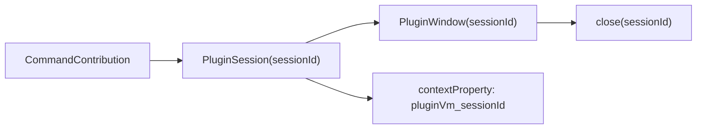
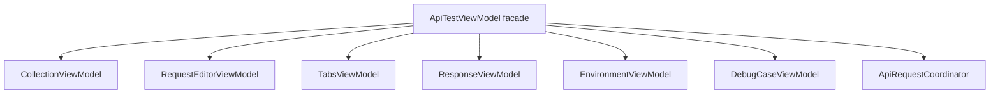
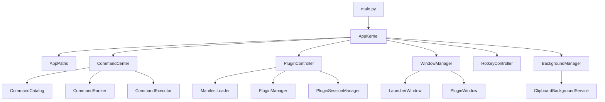
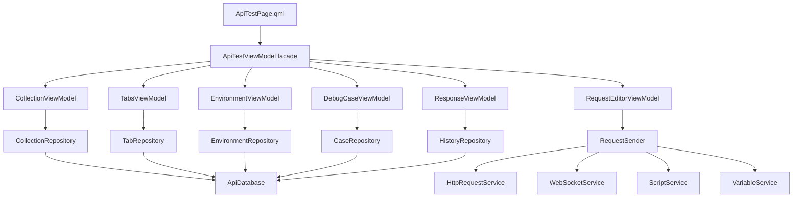

# PySide6 / QML 高级整改扫描报告

本文档基于当前项目代码状态，从高级 PySide6/QML 桌面应用开发视角，对架构、生命周期、线程、数据库、插件框架、QML 组件和可维护性进行完整扫描，并给出后续整改路线。

当前结论：项目的“类 uTools 插件化启动器”方向是正确的，Manifest + Runtime + Session 的主链路已经形成。第一批高风险问题已经收口，尤其是 API 测试插件的树模型、环境表、Tab 关联和请求日志。下一阶段主要复杂度集中在 API 测试 ViewModel 拆分、Qt 化后台任务、应用启动主流程和插件窗口/session 生命周期。

## 1. 扫描范围

本次重点扫描以下区域：

- 应用入口与窗口生命周期：`src/app/main.py`
- 启动器与插件窗口：`src/app/launcher/LauncherWindow.qml`、`src/app/launcher/PluginWindow.qml`
- 插件框架：`src/app/plugins/*`
- 命令搜索与推荐：`src/app/commands/*`
- API 测试插件：`src/features/api_test/*`
- 剪切板后台插件：`src/features/clipboard/*`
- 其他自带插件：JSON、二维码、图片压缩、下载、抓包、系统页
- 基础设施：主题、UI 组件、图标、热键、托盘、SQLite 数据目录

## 2. 整体判断

### 2.1 做得对的方向

- 自带插件已经基本和外部插件一样通过 `plugin.json` 发现和加载，这是后续开放插件 API 的正确基础。
- `PluginManifest`、`PluginRuntime`、`PluginSession` 的抽象方向清晰，已经能支持懒加载、后台插件、inline view、list、window 等模式。
- 剪切板插件拆成后台服务和 inline view，这个方向符合 uTools 类应用的常驻插件模型。
- 命令推荐已经开始基于输入内容和剪切板内容做上下文匹配，适合继续演进成插件贡献点机制。
- API 测试模块已经从“大页面”开始拆组件，`ApiResponsePanel`、`ApiEndpointTabsBar`、`KvTableSection` 等组件拆分方向是对的。

### 2.2 当前主要问题

- API 测试模块的树模型已经切到数据库节点表，普通树操作不再整棵树回写。但 `ApiCollectionSidebar.qml` 仍然较大，内部还保留用于当前渲染快照定位的 `nodePath` 和递归 flatten 逻辑，后续可以继续抽成更薄的树展示组件。
- `ApiTestViewModel` 已经开始瘦身，请求编辑器状态、Tab 编排、环境状态、调试用例状态、响应状态和请求发送协调器已经拆出；API 测试的 HTTP/file/mock/WebSocket 请求、下载任务、图片压缩任务已经迁到通用 `TaskRunner`。它仍是 QML facade，后续重点是继续拆独立子 ViewModel 和完善历史/自动接收等增量功能。
- 主入口 `main.py` 承担了启动、热键、托盘、插件窗口、session 分发、重启、热重载等职责，不利于修窗口生命周期问题。
- 线程模型已经完成第一轮 Qt 化，主要慢任务都经 `TaskRunner` 回到主线程通知 QML；剩余问题是部分任务还缺少用户可见的取消状态。
- 插件多实例与 session 存储方式冲突，当前声明和实现不一致。
- 数据目录、数据库初始化、迁移逻辑散落在多个模块中。

## 3. 高优先级风险清单

### P0：API 树模型没有收口

相关文件：

- `src/features/api_test/service.py`
- `src/features/api_test/view_model.py`
- `src/features/api_test/components/ApiCollectionSidebar.qml`
- `src/features/api_test/ApiTestPage.qml`

当前状态：已基本落地。

已完成：

- `api_collection_nodes` 是 API 树唯一持久化数据源。
- 普通新增、重命名、复制、删除、移动、排序、展开/收起都按数据库 `id` 做节点级更新。
- QML 不再生成业务 id，不再用 `_nodeId`、`treePatched`、本地 `selected` 作为主流程。
- `replaceCollectionTree` / `saveCollectionTree` 只保留给 OpenAPI 导入这种整批替换场景。
- Tab 与树节点只通过 `nodeId` 关联，不再保存 `nodePath`。
- `case` 已经是 endpoint 子节点，场景快照保存在节点 `request_json`。

仍保留的实现细节：

- `ApiCollectionSidebar.qml` 内部仍使用 `nodePath` 定位当前渲染快照里的行，这是 UI 层临时定位，不再作为持久化身份。
- 侧边栏仍然较大，后续可以继续拆成“树扁平化模型 + 行组件 + 菜单组件”。

目标形态：

- 数据库 id 是唯一身份。
- QML 不生成业务 id。
- QML 不整棵树回写。
- 树操作只传 `nodeId`。
- 后端完成创建、删除、重命名、移动、排序、展开状态更新。
- 前端收到后端返回的新树或可见行模型后刷新。

后续建议：

1. 保持普通树操作只传 `nodeId`。
2. 保留 `replaceCollectionTree` 只用于 OpenAPI 导入。
3. 继续瘦身 `ApiCollectionSidebar.qml`，让它更接近展示组件。
4. 如果后续引入真实树模型，可以由 Python 返回扁平可见行，QML delegate 不再递归 flatten。

### P0：插件后台生命周期顺序有问题

相关文件：

- `src/app/main.py`
- `src/app/plugins/background_manager.py`
- `src/app/plugins/plugin_manager.py`
- `src/app/plugins/session_manager.py`

当前退出时连接顺序是：

1. `session_mgr.close_all`
2. `background_mgr.stop_all`
3. `command_index.close`

但 `session_mgr.close_all()` 内部会调用 `plugin_manager.close_all()`，它会把所有 runtime 弹出并执行 `on_exit()`。后台 runtime 被弹出后，`background_mgr.stop_all()` 再调用时可能拿不到 runtime，导致 `on_background_stop()` 不执行。

目标形态：

- 后台插件由 `BackgroundManager` 负责停止。
- `PluginManager.close_all()` 不应抢先销毁仍在后台运行的 runtime。
- 退出顺序应该是：关闭普通 UI session -> 停止后台插件 -> 关闭所有 runtime -> 关闭数据库。

建议：

1. `PluginSessionManager.close_all()` 只关闭活跃 session，不调用 `plugin_manager.close_all()`。
2. `main.py` 退出时显式调用一个 `AppKernel.shutdown()`。
3. `shutdown()` 内部顺序固定：
   - unregister hotkeys
   - close launcher/plugin windows
   - close normal sessions
   - stop background plugins
   - close plugin manager
   - close databases

### P1：插件多实例设计与实现冲突

相关文件：

- `src/app/plugins/session_manager.py`
- `src/app/main.py`
- `src/app/plugins/runtime.py`

当前 `PluginSessionManager` 用 `dict[str, PluginSession]` 保存 session，key 是 `plugin_id`。每次 `open_plugin()` 都先 `close_plugin(plugin_id)`。但 `plugin.json` 的 `window.multiInstance` 又允许多窗口。

这意味着多实例窗口即使创建了，也会共享或覆盖同一个 context property 和 session，容易出现窗口 A 关闭时销毁窗口 B ViewModel 的问题。

目标形态二选一：

- 简化方案：暂时不支持同插件多实例，删除或忽略 `multiInstance`。
- 完整方案：引入 `sessionId`，所有窗口、context property、session 都按 `sessionId` 管理。

建议优先采用简化方案，直到插件系统稳定。如果需要多实例，再设计：



### P1：线程模型不够 Qt 化

相关文件：

- `src/features/api_test/view_model.py`
- `src/features/download/service.py`
- `src/features/api_test/http_service.py`
- `src/features/api_test/ws_service.py`

当前第一轮已经改成 Qt 化任务模型：API 测试 HTTP/file/mock/WebSocket、下载、图片压缩都通过 `TaskRunner` 执行后台任务，并由 QObject Signal 回到主线程通知 QML。剩余问题主要是部分长任务缺少用户可见的取消状态和更细的连接状态。

风险：

- 插件窗口关闭后，未完成任务应取消回调或忽略结果。
- ViewModel 已 dispose 后，后台结果不能继续写回 UI 状态。
- 下载任务已支持取消，取消中任务会更新状态并删除未完成临时文件。
- WebSocket `recv()` 已从 UI 线程迁走，并已补当前 Tab 的连接状态展示；后续如果需要可继续做自动接收。

目标形态：

- 统一引入 `TaskRunner` 或 `QThreadPool + QRunnable`。
- 所有后台任务通过一个主线程 QObject 派发结果。
- 插件 session 关闭时能取消或忽略过期任务。
- 所有结果携带 `requestId/sessionId`，避免旧请求覆盖新请求。

建议：

1. 保持 `src/app/qt/task_runner.py` 作为统一后台任务入口。
2. API 请求、文件下载、图片压缩、WebSocket 等慢操作统一走任务运行器。
3. ViewModel 只启动任务和接收结果，不直接管理 `threading.Thread`。
4. 每个 ViewModel 在 `dispose()` 时标记 `_disposed = True`，任务结果回来时先判断。

### P1：API 测试 ViewModel 过大

相关文件：

- `src/features/api_test/view_model.py`

当前 `ApiTestViewModel` 已开始从“大而全”转成 facade。已拆出：

- `RequestEditorState`：params、headers、cookies、body、auth、mock、前后置脚本。
- `TabsController`：打开接口/场景、切换当前 Tab、关闭 Tab、普通 Tab 草稿保存、场景快照保存。
- `EnvironmentState`：环境列表、当前环境索引、当前 Base URL。
- `DebugCaseState`：调试用例列表、选中用例 id、按 id/index 切换选择。
- `ResponseState`：响应标题、Body、响应头、实际请求、cURL、请求日志分组。
- `RequestSenderCoordinator`：HTTP/file/mock/WebSocket 请求发送、busy/requestId、请求历史、loading 回调。
- `TaskRunner`：通用 Qt 后台任务运行器，使用 `QThreadPool + QRunnable`，并通过 QObject Signal 回到主线程执行回调。

它仍然直接负责：

- API 树选择与同步
- 文件上传的编辑态组织
- 请求历史的高级恢复交互，例如按历史恢复完整 headers/body/env 快照

当前 ViewModel 已按页面区域拆出 notify signal，例如 `tabsChanged`、`editorChanged`、`responseChanged`、`environmentsChanged`、`collectionDataChanged`、`debugCasesChanged`、`wsTimelineChanged`。后续如果继续拆子 ViewModel，不要退回一个 `_dataChanged` 管所有属性的方式。

目标形态：



建议：

1. 第一阶段不急着拆 QML context，可以先让 `ApiTestViewModel` 作为 facade。
2. 内部先拆纯 Python 状态类和仓储类。
3. 每个大属性使用独立 notify signal，避免 `_dataChanged` 全量刷新。
4. 删除旧 Slot 和重复入口，只保留 QML 当前实际调用的接口。

### P1：API 测试 Service 过大

相关文件：

- `src/features/api_test/service.py`
- `src/features/api_test/case_service.py`
- `src/features/api_test/ws_service.py`
- `src/features/api_test/variable_service.py`
- `src/features/api_test/http_service.py`

当前 `ApiTestService` 已经完成第一轮瘦身：数据库初始化迁到 `ApiDatabase`，树迁到 `CollectionRepository`，环境迁到 `EnvironmentRepository`，Tab 和请求历史迁到 `TabRepository`。它现在仍负责导入 OpenAPI、HTTP、WebSocket、调试场景和变量编排，后续还可以继续拆薄。

目标形态：

```text
api_test/
  db.py                  # 连接、PRAGMA、迁移版本
  repositories/
    collection_repo.py   # api_collection_nodes
    tab_repo.py          # http_tabs
    env_repo.py          # environments
    history_repo.py      # http_history
    case_repo.py         # debug_cases
  services/
    request_sender.py
    openapi_importer.py
    websocket_service.py
```

已完成：

1. `ApiDatabase` 统一管理 db path、连接、schema version。
2. `CollectionRepository` 管理 API 树。
3. `EnvironmentRepository` 管理环境、环境变量、环境请求头。
4. `TabRepository` 管理普通请求 Tab 和请求历史。

后续建议：

1. 抽 `OpenApiImporter`，把导入解析从 `ApiTestService` 移出。
2. 把 `DebugCaseService` 改造成 `CaseRepository + CaseRunner`。
3. 把 WebSocket、HTTP 发送和变量提取放到独立 coordinator。

### P1：启动主流程需要拆 AppKernel

相关文件：

- `src/app/main.py`

`main.py` 已经超过 20KB，承担职责过多：

- QApplication / QQmlApplicationEngine 初始化
- QML context 注入
- manifest 加载
- command service 初始化
- background manager 初始化
- hotkey 注册
- clipboard hotkey 注册
- plugin hotkey 注册
- launcher window 定位
- plugin window 创建和居中
- session 生命周期
- tray
- restart
- hot reload

目标形态：

```text
app/
  main.py                 # 只创建 QApplication 并启动 AppKernel
  kernel.py               # 组装服务和 shutdown
  window_manager.py       # launcher/plugin window 管理
  hotkey_controller.py    # 全局热键和插件热键
  plugin_controller.py    # bridge signal -> session/window
  paths.py                # data/plugin/config 路径
```

拆分后，窗口闪烁、尺寸变化、对象已删除这类问题会更容易定位。

### P2：命令搜索服务职责偏多

相关文件：

- `src/app/commands/command_service.py`
- `src/app/commands/context.py`
- `src/app/commands/command_index_db.py`

当前 `CommandService` 同时负责：

- 插件命令生成
- 动态命令生成
- 系统命令生成
- Windows app 扫描触发
- scoring/ranking
- usage 记录
- 启动系统命令

目标形态：

```text
commands/
  command_catalog.py      # 插件/动态/系统/app 贡献项
  command_ranker.py       # 评分、上下文推荐
  command_executor.py     # 启动 app/system/plugin
  command_index_db.py     # 只做持久化
```

额外问题：Windows app 扫描现在可能在搜索时同步触发，扫描 `.lnk` 和提取图标会阻塞 UI。建议首次启动后异步扫描，搜索时只读缓存。

### P2：QML 组件职责仍然偏重

相关文件：

- `src/app/launcher/LauncherWindow.qml`
- `src/features/api_test/components/ApiCollectionSidebar.qml`
- `src/features/api_test/EnvManagerDialog.qml`
- `src/features/clipboard/ClipboardWindowPage.qml`

QML 适合负责展示和交互状态，不适合承载业务数据结构变更。当前尤其是 `ApiCollectionSidebar.qml` 仍然有大量业务逻辑，包括生成 id、克隆树、移动节点、推断类型、维护 selected。

整改原则：

- QML 只发意图：`renameRequested(nodeId, name)`。
- Python 决定数据怎么变。
- QML 不持久化业务数据。
- 大列表使用 model，而不是在 QML 里频繁递归 flatten。
- Popup 定位统一封装，不在多个组件里重复手写。

### P2：剪切板“最新内容”语义不正确

相关文件：

- `src/features/clipboard/service.py`
- `src/app/launcher/launcher_bridge.py`
- `src/app/commands/context.py`

`ClipboardHistoryStore.latest_item()` 当前按 `pinned DESC, id DESC` 排序。这个排序适合历史列表，但不适合命令推荐。推荐插件时需要“真实最新复制内容”，否则置顶的旧图片会长期影响推荐排序。

建议：

- `search()` 保持 `pinned DESC, id DESC`。
- 新增 `latest_captured_item()`，按 `id DESC`。
- `LauncherBridge._latest_clipboard_item()` 使用 `latest_captured_item()`。

### P2：数据目录和数据库策略分散

相关文件：

- `src/app/commands/command_index_db.py`
- `src/features/clipboard/runtime.py`
- `src/features/api_test/service.py`

当前多个模块各自解析 `PY_DESKTOP_TOOLS_DATA_DIR` 或默认 `data/`，容易出现路径不一致。

建议新增：

```text
src/app/paths.py
```

提供：

- `app_root()`
- `project_root()`
- `data_dir()`
- `plugin_dirs()`
- `cache_dir()`
- `db_path(name)`

所有模块统一引用。

### P2：主题 token 暗色模式存在明显不一致

相关文件：

- `src/app/theme/Theme.qml`

暗色主题里 `color-text-primary` 和 `color-text-regular` 仍是 `#333333`，在深色背景上对比度明显不对。后续如果做暗色模式，应先修 token，而不是在各组件里补颜色。

建议：

- 暗色主文本使用接近 `#E5E7EB`。
- 次级文本使用 `#94A3B8`。
- 禁止组件硬编码业务颜色，优先走 token。

### P2：插件 API 边界还不够稳定

相关文件：

- `src/app/plugins/runtime.py`
- `src/app/plugins/manifest.py`
- `docs/plugin-development.zh-CN.md`

`PluginContext.services` 当前是 `dict[str, object]`，服务 key 是约定字符串，如 `clipboard.background`。这对内部开发很快，但对外部插件不够稳。

建议：

- 为开放插件定义最小 API：
  - Clipboard API
  - Storage API
  - Notification API
  - Dynamic Command API
  - Window API
- `PluginContext.services` 内部保留，但对外包装成明确接口。
- 插件文档不要鼓励外部插件直接依赖内部类。

## 4. 推荐目标架构



API 测试插件目标架构：



## 5. 分阶段整改计划

### 阶段 1：先修确定 bug 和生命周期风险

状态：已基本完成。

目标：不大拆架构，先把已知错误和不稳定点处理掉。

完成情况：

1. 复制节点已由后端 `duplicateCollectionNode(nodeId)` 持久化。
2. 后台插件退出顺序已调整为普通 session -> background -> runtime。
3. 剪切板推荐使用真实最新记录，不再受置顶记录影响。
4. API 请求结果携带 `requestId`，旧请求结果不会覆盖新请求。
5. `api_utils.js` 中旧树快照辅助逻辑已清理。
6. `sendCurrentRequest()` 保留为错误提示入口，真实发送由 QML 传完整请求数据。

验收：

- 重命名、复制、删除、展开收起刷新后仍正确。
- 置顶旧剪切板记录不会影响图片/JSON 推荐。
- 关闭 API 测试窗口时没有 worker 结果继续写 UI。
- 应用退出时剪切板监听能正常断开。

### 阶段 2：收口 API 树数据模型

状态：已完成主链路。

目标：树以数据库节点表为唯一数据源。

完成情况：

1. 已新建 `ApiDatabase` 和 `CollectionRepository`。
2. `load_collection_tree()` 返回树，节点字段保留：
   - `id`
   - `parentId`
   - `kind`
   - `name`
   - `method`
   - `path`
   - `expanded`
   - `children`
   - `requestSnapshot`
3. QML 已删除 `_nodeId` 业务 id 生成逻辑。
4. 普通操作已删除 `treePatched` 整树回写。
5. Tab 保存 `nodeId`，不再保存 `nodePath`。
6. 场景作为 endpoint 子节点保存，场景数据放 `request_json`。
7. 环境表和 Tab/History 仓储也已顺手拆出。

验收：

- 所有树操作只传 `nodeId`。
- 移动和过滤后右键菜单仍操作正确节点。
- 重启应用后树结构、展开状态、Tab 关联都正确。

### 阶段 3：拆 API 测试 ViewModel / Service

状态：已开始落地。

目标：降低单文件复杂度，减少 QML 刷新和交互抖动。

已完成：

1. 已抽 `RequestEditorState`，管理 params、headers、cookies、body、auth、mock、前后置脚本。
2. 已抽 `TabsController`，管理打开、切换、关闭、实时保存，并区分普通接口 Tab 与场景快照。
3. 已抽 `EnvironmentState`，管理环境列表和当前环境。
4. 已抽 `DebugCaseState`，管理调试用例列表和选择状态。
5. 已抽 `RequestSenderCoordinator`，管理请求发送、busy/requestId、请求历史和 loading 回调。
6. `ApiTestViewModel` 暂时作为 facade，QML 绑定保持不变。
7. `dispose()` 已去掉盲目 Signal disconnect，减少窗口关闭时的 RuntimeWarning。

待继续：

1. 响应状态已抽成 Python `ResponseState`，QML `ApiResponsePanel` 只负责展示。
2. WebSocket 已迁到 `RequestSenderCoordinator + TaskRunner`，并已有当前 Tab 状态展示；后续可补自动接收。
3. `_dataChanged` 已拆成按页面区域划分的 notify signal。

阶段验收：

- `view_model.py` 第一轮变薄，后续可继续拆独立子 ViewModel。
- 修改响应、参数行、环境、树等数据时不再通过同一个 notify 刷新整页。
- 参数区拖动和编辑不再抖动。

### 阶段 4：Qt 化后台任务

状态：已开始落地。

目标：统一后台任务生命周期。

已完成：

1. 新增 `src/app/qt/task_runner.py`。
2. API HTTP/file/mock 请求迁移到 `TaskRunner`。
3. API WebSocket 连接、发送、接收、断开迁移到 `TaskRunner`，ViewModel 只做槽函数转发。
4. `RequestSenderCoordinator.dispose()` 会 cancel runner 上的未完成回调，窗口关闭后不会继续把结果写回 ViewModel。
5. 下载插件迁移到 `TaskRunner`，下载进度和完成消息回到 Qt 主线程后再通知 QML。
6. 图片压缩插件迁移到 `TaskRunner`，避免大图压缩阻塞 UI。
7. 下载插件支持取消单个任务，取消中/已取消状态会回写任务列表。
8. WebSocket 操作支持当前 Tab 状态展示，如正在连接、已连接、正在接收、错误、已断开。

待继续：

1. WebSocket 自动接收需要单独设计开关、频率和关闭行为。
2. HTTP 历史已有最近请求列表和 method/url 恢复，完整恢复 headers/body/env 快照需要后续扩展历史表结构。

验收：

- 慢 HTTP 请求不阻塞 UI。
- 下载、图片压缩、WebSocket 连接和接收不再直接阻塞 UI 线程。
- 关闭插件窗口后不再有跨对象 emit 报错。
- 多次快速发送请求，响应归属正确。

### 阶段 5：拆应用内核与窗口管理

目标：让 `main.py` 只负责启动。

任务：

1. 新建 `AppKernel`。
2. 新建 `WindowManager`，管理 launcher 和 plugin windows。
3. 新建 `HotkeyController`，管理 Alt+Space、剪切板快捷键、插件快捷键。
4. 新建 `PluginController`，连接 `LauncherBridge` 信号与 session/window。
5. 统一 shutdown。

验收：

- `main.py` 控制在 100 行左右。
- 插件窗口创建、关闭、居中逻辑都在 `WindowManager`。
- 不再出现 `QQuickWindow already deleted` 类问题。

### 阶段 6：命令系统和插件 API 稳定化

目标：为开放外部插件做准备。

任务：

1. 拆 `CommandCatalog`、`CommandRanker`、`CommandExecutor`。
2. Windows app 扫描后台化。
3. 定义插件 API facade，不让外部插件直接拿内部 service 对象。
4. 完善 `plugin-development.zh-CN.md`，写清 launch modes、context matchers、生命周期。
5. 增加 manifest 校验错误信息。

验收：

- 新插件只需要 `plugin.json + runtime.py + view_model.py + qml`。
- 外部插件不依赖 `src/features` 内部实现。
- 搜索输入时不会因为首次扫描 app 卡顿。

## 6. 建议的最终数据库原则

### 6.1 API 测试树

保留：

```sql
CREATE TABLE api_collection_nodes (
    id TEXT PRIMARY KEY,
    parent_id TEXT NOT NULL DEFAULT '',
    kind TEXT NOT NULL,
    name TEXT NOT NULL,
    method TEXT NOT NULL DEFAULT '',
    url TEXT NOT NULL DEFAULT '',
    request_json TEXT NOT NULL DEFAULT '{}',
    sort_order INTEGER NOT NULL,
    expanded INTEGER NOT NULL DEFAULT 0,
    created_at INTEGER NOT NULL,
    updated_at INTEGER NOT NULL
);
```

建议新增约束或索引：

```sql
CREATE INDEX idx_api_collection_nodes_parent_order
ON api_collection_nodes(parent_id, sort_order);

CREATE INDEX idx_api_collection_nodes_kind
ON api_collection_nodes(kind);
```

原则：

- folder 可以有 folder / endpoint 子节点。
- endpoint 可以有 case 子节点。
- case 不允许有子节点。
- endpoint 的请求草稿可以放在 `request_json` 或关联独立 request 表。
- case 的场景快照放在 `request_json`。

### 6.2 Tab

`http_tabs` 现在只保存编辑器草稿和 `node_id`，不再保存 `node_path`。普通接口 Tab 草稿写入 `http_tabs`，场景 Tab 直接写回 `api_collection_nodes.request_json`。

### 6.3 环境

环境已经从 `app_state.environments` JSON 改成结构化表。当前不兼容旧数据，`ApiTestService` 通过 `PRAGMA user_version` 管理 schema，版本不一致时会重建 API 测试插件自己的表。

当前环境表：

```sql
CREATE TABLE api_environments (
    id TEXT PRIMARY KEY,
    name TEXT NOT NULL,
    base_url TEXT NOT NULL DEFAULT '',
    sort_order INTEGER NOT NULL,
    created_at INTEGER NOT NULL,
    updated_at INTEGER NOT NULL
);

CREATE TABLE api_environment_variables (
    id TEXT PRIMARY KEY,
    environment_id TEXT NOT NULL,
    enabled INTEGER NOT NULL DEFAULT 1,
    var_key TEXT NOT NULL DEFAULT '',
    var_value TEXT NOT NULL DEFAULT '',
    sort_order INTEGER NOT NULL,
    created_at INTEGER NOT NULL,
    updated_at INTEGER NOT NULL
);

CREATE TABLE api_environment_headers (
    id TEXT PRIMARY KEY,
    environment_id TEXT NOT NULL,
    enabled INTEGER NOT NULL DEFAULT 1,
    header_key TEXT NOT NULL DEFAULT '',
    header_value TEXT NOT NULL DEFAULT '',
    sort_order INTEGER NOT NULL,
    created_at INTEGER NOT NULL,
    updated_at INTEGER NOT NULL
);
```

读取时按 `sort_order, created_at` 排序后组装成 QML 需要的 `environments` 列表；保存时以当前列表为准重写环境和子表。

## 7. PySide6 / QML 开发规范建议

### 7.1 QObject 和 Property

- 大 ViewModel 不要所有属性共用一个 notify signal。
- Property setter 中避免做重 IO。
- QObject 生命周期由 session/window 统一管理，不在多个地方 deleteLater。
- `dispose()` 只断开自己主动连接过的外部信号，不建议盲目 disconnect 自己的 Signal。

### 7.2 QML

- QML 负责展示、输入和轻量 UI 状态。
- 业务数据修改放 Python。
- Popup 定位统一工具化。
- 大型 QML 组件超过 500 行就要考虑拆分。
- 列表/树优先使用扁平 model，delegate 不应持有业务身份推断逻辑。

### 7.3 线程

- 不直接用裸 `threading.Thread` 更新 UI。
- 使用 `QThreadPool`、`QRunnable`、QObject signal 或统一 TaskRunner。
- 任务结果必须带 requestId/sessionId。
- 窗口关闭后必须取消或忽略任务结果。

### 7.4 SQLite

- DB path 统一由 `app.paths` 提供。
- 每个功能库有明确 schema_version。
- DDL 和 repository 分离。
- 写操作尽量是节点级/记录级，不整表删除重写。
- 对列表读取提供稳定排序。

### 7.5 插件

- Runtime 是插件长期对象。
- Session 是一次打开/一次 UI 会话对象。
- Background plugin 的后台生命周期独立于 UI session。
- 如果不支持多实例，文档和 manifest 都不要暴露 `multiInstance`。
- 如果支持多实例，必须引入 sessionId。

## 8. 后续 AI 执行提示

后续让 AI 实施时，建议按以下约束给任务：

1. 一次只做一个阶段，不要同时改树模型、线程模型和窗口管理。
2. API 树整改优先保证数据正确，再优化交互。
3. 每次重构都同步更新本文档和 `docs/refactor-implementation-notes.zh-CN.md`。
4. 不兼容旧数据时，可以直接清空或重建相关表，但要在文档中说明。
5. 删除旧代码前先用 `rg` 确认没有引用。
6. 修改 QML 后至少手动启动应用验证，不依赖 smoke 脚本替代真实交互。

## 9. 推荐下一步

“阶段 1 + 阶段 2”的 API 树收口已经基本落地，“阶段 3”的主要 facade 拆分也已开始落地。当前更适合继续推进的是：

- 继续阶段 3：评估响应状态归属，细化 notify signal。
- 继续阶段 4：如需要，给 WebSocket 补自动接收开关和更细的连接生命周期操作。
- 补真实手动回归：重点验证 API 测试窗口、场景编辑、树右键、环境管理、请求发送与响应日志。

第一批建议实施文件：

- `src/features/api_test/view_model.py`
- `src/features/api_test/service.py`
- `src/features/api_test/http_service.py`
- `src/app/main.py`
- `src/app/plugins/session_manager.py`

第一批不建议同时改：

- 插件多实例
- AppKernel 拆分
- 外部插件 API 开放

这样可以保持现在已经稳定下来的树模型和环境模型不被再次搅乱，把精力集中到“瘦身 ViewModel”和“统一后台任务”这两个下一阶段收益最高的点上。
