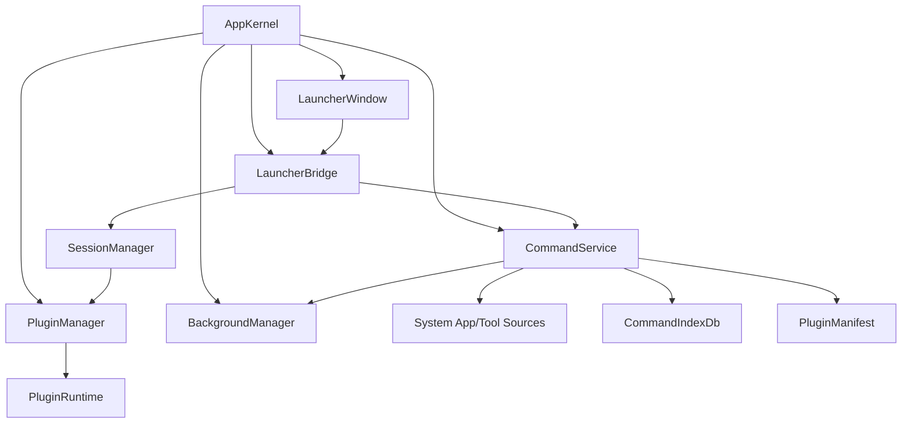
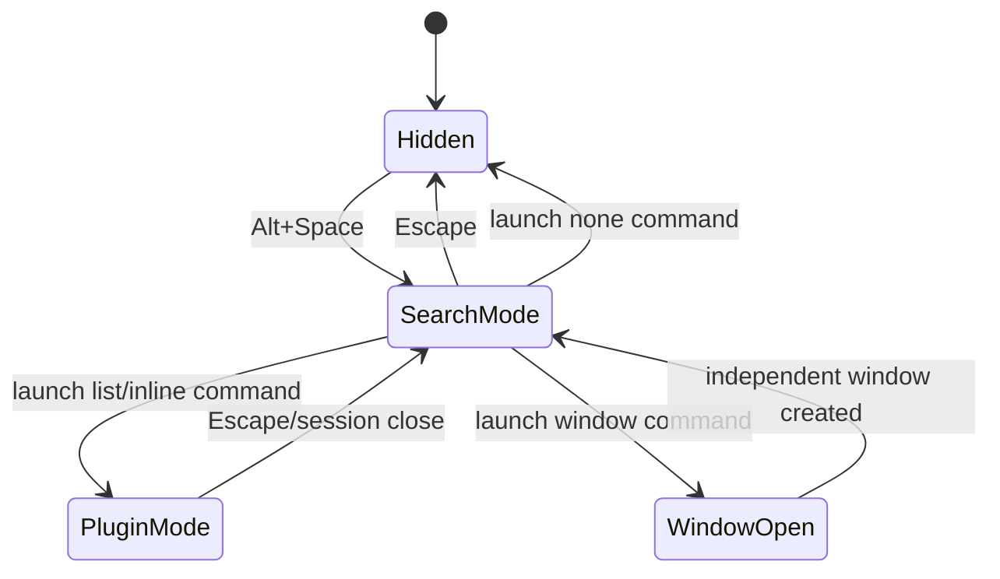

# Py Desktop Tools: uTools-like Architecture

This document is the architecture reference for turning this project into a
Python/QML version of a uTools-style desktop launcher. For the current
implemented state, removed legacy files, and reading path, prefer
`refactor-implementation-notes.zh-CN.md`. Use this document for module
boundaries and lifecycle direction, then verify current file paths against the
implementation notes.

## 1. Product Direction

The application should become a resident desktop command launcher, not a bundle
of eagerly loaded utility pages.

The product shape is:

- The app starts in the background.
- `Alt+Space` opens a compact launcher input.
- The launcher initially shows quick-start items.
- Typing searches commands from plugins, system apps, system tools, and dynamic
  commands contributed by plugins.
- Selecting an item launches the matching command.
- Plugins are lazy-loaded by default.
- Closing a plugin session releases its runtime resources.
- Background plugins can run resident services while keeping their UI lazy.
- Simple plugins can use a shared list template.
- Complex plugins can render custom inline UI below the input or open an
  independent window.

The primary design rule:

> The launcher is the app. Plugins are capabilities scheduled by the launcher.

## 2. uTools Concepts To Borrow

These uTools concepts should guide the Python design:

- The global search box is the main entry point.
- A plugin contributes one or more feature commands instead of being only a
  page.
- A command can be triggered by keywords or by smart matching on input payloads.
- Entering and exiting a plugin are explicit lifecycle events.
- Some plugins need no UI, some use a list template, and complex plugins use a
  custom view.
- Plugins can add or remove dynamic commands at runtime.

Official uTools docs used as design references:

- `plugin.json`, `features`, and `cmds`:
  <https://www.u-tools.cn/docs/developer/information/plugin-json.html>
- Plugin lifecycle events such as `onPluginEnter` and `onPluginOut`:
  <https://www.u-tools.cn/docs/developer/api-reference/utools/events.html>
- Dynamic feature commands:
  <https://www.u-tools.cn/docs/developer/api-reference/utools/features.html>
- Template plugin modes:
  <https://www.u-tools.cn/docs/developer/information/window-exports.html>

Do not copy uTools API names blindly. Borrow the product model and adapt it to
Python, PySide6, QML, and this codebase.

## 3. Architecture Summary

High-level runtime:



Core idea:

- `CommandItem` is the smallest searchable and launchable unit.
- `PluginManifest` is lightweight metadata loaded at app startup.
- `PluginRuntime` is the heavy implementation loaded only when needed.
- `PluginSession` represents one active launch of a plugin command.
- `LauncherWindow` renders search mode or the active plugin session.

## 4. Glossary

### Launcher

The global input window opened by `Alt+Space`. It owns the search input, result
list, and an optional embedded content area. It should not know feature-specific
logic.

### Command

A searchable action. Examples:

- Open JSON parser.
- Format clipboard text as JSON.
- Open API testing window.
- Launch Notepad.
- Open Windows Task Manager.
- Show clipboard history.
- Run a plugin-provided dynamic command.

Commands are more important than plugins in the launcher UX.

### Plugin

A provider of commands and runtime behavior. A plugin can contribute several
commands. A plugin may have no UI, list-template UI, custom inline UI, an
independent window, or background services.

### Manifest

Static plugin metadata and command declarations. Loading manifests must be cheap:
no ViewModel construction, no QML loading, no network calls, no long database
setup, no clipboard hooks.

### Runtime

The loaded Python implementation of a plugin. Runtime is created on command
launch or on app startup for background plugins.

### Session

A single active plugin interaction. Sessions own ViewModels, QML loaders,
windows, timers, threads, sockets, and signal connections created for that
interaction.

### Background Plugin

A resident service plugin. Example: clipboard history should listen to clipboard
changes at app startup, but its search UI should still load only when opened.

## 5. Module Responsibilities

Recommended target layout:

```text
src/
  app/
    kernel/
      app_kernel.py
      app_context.py
    launcher/
      LauncherWindow.qml
      SearchResultItem.qml
      launcher_bridge.py
      launcher_state.py
    commands/
      command_item.py
      command_service.py
      command_index_db.py
      matchers.py
      ranker.py
      system_app_source.py
      system_tool_source.py
    plugins/
      manifest.py
      plugin_context.py
      plugin_manager.py
      plugin_runtime.py
      plugin_session.py
      session_manager.py
      background_manager.py
      list_template_model.py
    theme/
    ui/
  features/
    json_parser/
      manifest.py
      runtime.py
      JsonParserPage.qml
      view_model.py
    clipboard/
      manifest.py
      runtime.py
      service.py
      ClipboardList.qml
    api_test/
      manifest.py
      runtime.py
      ApiTestPage.qml
```

Existing files do not need to be moved in one giant refactor. Migrate toward
this shape feature by feature.

### AppKernel

Owns app-level lifecycle:

- `QApplication` setup.
- QML engine setup.
- global theme object.
- global hotkey registration.
- system tray.
- top-level service construction.
- app shutdown.

It should not import feature ViewModels directly.

### LauncherBridge

The QObject bridge exposed to QML. It replaces the current broad
`PluginRegistryBridge`.

Responsibilities:

- expose `searchResults`.
- handle input changes.
- launch selected result.
- expose active mode: `search` or `plugin`.
- forward input to active plugin session.
- close active plugin session on Escape.

It should call services instead of implementing search or plugin logic itself.

### CommandService

The single place for search, matching, and ranking.

Inputs:

- plugin manifest commands.
- plugin dynamic commands.
- system app entries.
- system tool entries.
- usage history.
- pinned/favorite items, if added later.

Outputs:

- ranked `CommandItem` list for QML.

CommandService should not create plugin runtimes.

### CommandIndexDb

Persistent index and ranking storage. It can evolve from `QuickStartDb`.

Responsibilities:

- usage count.
- last used time.
- app shortcut cache.
- icon cache paths.
- dynamic plugin commands.
- optional pinned/favorite commands.

The DB is a cache and ranking store, not the source of truth for static plugin
manifests.

### PluginManager

Owns plugin discovery and lazy runtime loading.

Responsibilities:

- load all manifests cheaply at startup.
- return manifests for search.
- instantiate runtime on demand.
- cache active runtimes while sessions/background services need them.
- release runtime references after session close.

PluginManager should not know QML window details; that belongs to SessionManager.

### SessionManager

Owns active plugin sessions.

Responsibilities:

- enter a command.
- create plugin session.
- attach session UI to launcher or independent window.
- forward input changes.
- exit current session.
- close plugin windows.
- guarantee cleanup.

### BackgroundManager

Owns resident plugin services.

Responsibilities:

- load background plugins at app startup.
- call `on_background_start`.
- collect dynamic commands from background plugins.
- call `on_background_stop` on app exit.

The background part of a plugin must be separable from its UI session.

## 6. Data Models

### PluginManifest

Suggested Python model:

```python
from dataclasses import dataclass, field
from typing import Literal

PluginActivation = Literal["lazy", "background"]
LaunchMode = Literal["none", "list", "inline_view", "window"]

@dataclass(frozen=True)
class PluginManifest:
    id: str
    name: str
    version: str
    description: str
    icon: str
    entrypoint: str
    activation: PluginActivation = "lazy"
    commands: list["CommandContribution"] = field(default_factory=list)
```

Rules:

- `entrypoint` points to a runtime factory, for example
  `features.json_parser.runtime:create_runtime`.
- Manifest modules must be safe to import at startup.
- Manifest should not import heavy service modules unless unavoidable.

### CommandContribution

Static command declared by a plugin manifest:

```python
@dataclass(frozen=True)
class CommandContribution:
    id: str
    title: str
    subtitle: str = ""
    icon: str = ""
    keywords: list[str] = field(default_factory=list)
    launch_mode: LaunchMode = "inline_view"
    input_mode: Literal["global", "plugin"] = "plugin"
    matchers: list["MatchRule"] = field(default_factory=list)
```

Examples:

- JSON plugin can contribute `json.format`, `json.validate`, `json.query`.
- Clipboard plugin can contribute `clipboard.history`.
- API plugin can contribute `api.open`.

### CommandItem

Runtime search result rendered by the launcher:

```python
@dataclass
class CommandItem:
    id: str
    title: str
    subtitle: str
    icon: str
    source: Literal["plugin", "plugin_command", "system_app", "system_tool", "dynamic"]
    launch_mode: LaunchMode
    plugin_id: str | None = None
    command_id: str = ""
    payload: dict = field(default_factory=dict)
    score: float = 0
    highlight_start: int = -1
    highlight_len: int = 0
```

Every launcher result should be representable as `CommandItem`.

### PluginRuntime

Suggested protocol:

```python
class PluginRuntime:
    def on_enter(self, ctx: "PluginContext", action: "PluginAction") -> "PluginSession":
        ...

    def on_exit(self) -> None:
        ...

    def get_dynamic_commands(self) -> list[CommandContribution]:
        return []
```

For background plugins:

```python
class BackgroundPluginRuntime(PluginRuntime):
    def on_background_start(self, ctx: "PluginContext") -> None:
        ...

    def on_background_stop(self) -> None:
        ...
```

### PluginSession

Suggested protocol:

```python
class PluginSession:
    launch_mode: LaunchMode

    def create_qml_context(self) -> dict[str, object]:
        return {}

    def qml_page(self) -> str:
        return ""

    def list_model(self) -> list[dict]:
        return []

    def on_input_changed(self, text: str) -> None:
        ...

    def on_list_item_selected(self, item_id: str) -> None:
        ...

    def close(self) -> None:
        ...
```

Cleanup must happen in `close`.

## 7. Launcher State Machine

Launcher has two primary states.

### SearchMode

Default state.

- Input text goes to `CommandService.search(text)`.
- Result list shows global commands.
- Enter launches selected command.
- Escape hides launcher.

### PluginMode

Entered when selected command opens a `list` or `inline_view` session.

- Input text goes to `active_session.on_input_changed(text)`.
- Result area is controlled by the active session.
- Escape closes active session and returns to SearchMode.
- Closing the launcher should close non-background sessions unless the session
  explicitly supports hiding.

State flow:



## 8. Launch Modes

### none

No UI. Execute and return to search or hide launcher.

Examples:

- open system app.
- run system command.
- copy generated text.
- execute plugin command.

### list

Use shared list-template UI below the input.

Examples:

- clipboard history.
- recent files.
- app search.
- simple command palettes.

The plugin provides rows and handles selection. The launcher owns the visual
template.

### inline_view

Load custom QML below the input.

Examples:

- JSON formatter.
- QR generator.
- image compressor.

The plugin provides ViewModel objects for that session only.

### window

Open an independent window.

Examples:

- API testing workbench.
- complex packet analyzer.
- multi-pane settings.

Window plugins should be lazy-loaded when opened and cleaned when their window
closes.

### background

Not a launch mode by itself. It is an activation mode for resident services.
Background plugins may also expose `list`, `inline_view`, or `none` commands.

## 9. Plugin Lifecycle

### Startup

Do:

- load app kernel.
- create QML engine.
- load plugin manifests.
- seed command index from manifests.
- scan/load cached system app/tool sources.
- start background plugins only.

Do not:

- create every plugin ViewModel.
- load every plugin QML page.
- initialize every plugin database.
- create network clients or timers for lazy plugins.

### Command Launch

Flow:

1. Launcher asks `SessionManager.launch(command_item, current_input)`.
2. SessionManager asks PluginManager for runtime if needed.
3. PluginManager imports runtime entrypoint and creates runtime.
4. Runtime receives `on_enter(ctx, action)`.
5. Runtime returns a session.
6. SessionManager attaches session according to `launch_mode`.
7. CommandIndexDb records usage.

### Input Forwarding

If Launcher is in PluginMode:

```text
search input text -> active_session.on_input_changed(text)
```

The global CommandService should not run while in PluginMode unless the session
explicitly asks to return to SearchMode.

### Session Close

On Escape, window close, or explicit close:

- call `session.close()`.
- disconnect Qt signals created for the session.
- stop session timers/threads/sockets.
- clear QML Loader or close independent Window.
- remove session ViewModel context properties.
- release runtime reference if no other session/background service needs it.

### Runtime Unload Semantics

In Python, real module unloading is not reliable. Treat "unload plugin" as:

- no live runtime instance.
- no live ViewModel/QObject references.
- no active timers, threads, sockets, file watchers, clipboard hooks, or DB
  connections created by the session.
- no QML Loader/Window holding plugin objects.

Do not depend on deleting entries from `sys.modules` for correctness.

## 10. Search And Ranking

Default launcher results should combine:

- plugin static commands.
- plugin dynamic commands.
- system apps.
- system tools.
- recent and frequently used items.

Ranking inputs:

- exact title match.
- title prefix match.
- keyword exact/prefix/contains match.
- pinyin and pinyin-initial match for Chinese names.
- dynamic match rules from plugins.
- use count.
- recent use time.
- pinned/favorite boost if added later.

Search output should be stable and predictable:

- no query: show quick-start items sorted by usage, pinned, and built-in order.
- query: show best semantic matches first.
- commands from the active plugin should only take over in PluginMode.

## 11. Match Rules

Static command keywords are not enough. Add match rules inspired by uTools smart
matching.

Suggested match types:

```python
MatchType = Literal[
    "keyword",
    "regex",
    "text",
    "url",
    "file",
    "image",
    "json",
    "clipboard"
]
```

Examples:

- JSON plugin can match text starting with `{` or `[`.
- QR plugin can match URL/text.
- Image compressor can match image file paths.
- Clipboard plugin can match empty/default input and provide history.

First version can implement only `keyword`, `regex`, and simple text predicates.

## 12. Background Plugin Pattern

Use clipboard as the reference design.

Bad design:

```text
ClipboardPlugin loads ViewModel + QML + service at app startup.
```

Good design:

```text
ClipboardBackgroundRuntime
  starts at app startup
  listens to clipboard
  writes clipboard.db
  contributes dynamic commands if needed

ClipboardListSession
  starts when user opens clipboard command
  reads/searches clipboard.db
  provides list rows
  closes when user exits plugin mode
```

This separates resident behavior from UI behavior.

## 13. QML Integration Rules

Avoid global context properties for every plugin.

Current pattern to move away from:

```python
ctx.setContextProperty("jsonParserVm", JsonParserViewModel())
ctx.setContextProperty("apiTestVm", ApiTestViewModel())
```

Target pattern:

- App-level context exposes stable services only:
  - `app`
  - `launcherBridge`
  - `theme`
- Plugin session provides temporary context properties only while active.
- Inline plugin QML is loaded by a session-owned Loader.
- Independent plugin windows receive session-owned properties.

If QML context injection into an already-loaded engine is awkward, create a
small `PluginViewHost` QObject that owns session properties and is exposed as
`pluginHost` to the loaded component.

## 14. Error Handling

Plugin failures must not crash the launcher.

Rules:

- Manifest load failure disables that plugin and logs the reason.
- Runtime load failure shows a launcher error row/toast.
- Session creation failure returns to SearchMode.
- Plugin close failure is logged but should not block launcher recovery.
- Background plugin failure disables only that background plugin.

## 15. Development Contracts For Future AI Agents

When implementing this architecture:

- Do not add new eager ViewModel creation in `app.main`.
- Do not make LauncherWindow import feature-specific QML directly.
- Do not let CommandService instantiate plugin runtimes.
- Do not put business logic into QML if a ViewModel/service boundary is
  available.
- Do not make background services depend on their UI sessions.
- Prefer manifest metadata for startup search.
- Keep plugin runtime imports behind PluginManager.
- Ensure every session has a cleanup path.
- Add small migration tests around search, lifecycle, and plugin close behavior.

## 16. Migration Plan

### Phase 1: Name The New Core

Create new modules while keeping old behavior working:

- `app.commands.command_item`
- `app.commands.command_service`
- `app.commands.command_index_db`
- `app.plugins.manifest`
- `app.plugins.plugin_manager`
- `app.plugins.session_manager`
- `app.launcher.launcher_bridge`

Keep old `PluginRegistryBridge` until the new bridge can replace it.

### Phase 2: Manifest-Only Startup

Change startup from eager plugin construction to manifest loading:

- Existing `plugin.py` files can temporarily expose manifests.
- Stop calling `create_view_model()` for every plugin at startup.
- Seed command index from manifests.
- Keep current QML pages unchanged until each plugin migrates.

### Phase 3: First Lazy Plugin

Migrate `json_parser` as the first `inline_view` lazy plugin because it is small.

Expected result:

- JSON command appears in launcher from manifest.
- Selecting it loads `JsonParserRuntime`.
- Runtime creates `JsonParserViewModel`.
- Launcher enters PluginMode and loads `JsonParserPage.qml`.
- Escape closes the session and releases the ViewModel.

### Phase 4: First Background + List Plugin

Migrate `clipboard`.

Expected result:

- Background service starts at app startup.
- Clipboard UI does not load until selected.
- Clipboard command opens shared list-template UI.
- Input filters clipboard history.
- Selecting a row copies it and closes or stays open depending on UX decision.

### Phase 5: System Sources

Move system apps and system tools behind command sources:

- `SystemAppSource`
- `SystemToolSource`
- icon extraction/cache
- app rescan policy

All system results become `CommandItem`.

### Phase 6: Window Plugins

Migrate heavy plugins:

- API test as `window`.
- App launcher can become `list` or `window`.
- Packet capture can remain prototype until real capture is designed.

### Phase 7: Remove Old Registry Shape

After migrated plugins work:

- remove direct ViewModel injection for plugins.
- remove old `PluginRegistryBridge`.
- rename `QuickStartDb` to `CommandIndexDb`.
- update README and verification notes after removing the old smoke script.

## 17. Current Project Notes

Current project observations that matter for migration:

- `src/app/main.py` currently imports all feature plugins and creates all
  ViewModels at startup. This conflicts with lazy loading.
- `PluginMeta.mode` currently has only `independent` and `mixed`. Replace this
  with clearer launch modes: `none`, `list`, `inline_view`, `window`.
- `QuickStartDb` already contains useful ideas: unified item table, pinyin
  search, use count, system commands, app shortcut cache. It should evolve into
  `CommandIndexDb`.
- `PluginRegistryBridge` already centralizes search/launch calls from QML. It
  can evolve into `LauncherBridge`.
- `ClipboardPlugin` should become the reference background plugin.
- `ApiTestPlugin` should become a window plugin because it is a complex
  workbench.
- `PacketCaptureService` currently generates mock rows and should not be treated
  as complete real packet capture.
- README and verification notes are behind the current code and should be
  updated during migration. The old `tools/feature_smoke.py` script has been
  removed.

## 18. Suggested Plugin Classifications

Initial target classifications:

| Plugin | Activation | Launch mode | Notes |
| --- | --- | --- | --- |
| JSON parser | lazy | inline_view | Good first migration target. |
| Clipboard | background | list | Background service plus lazy list UI. |
| Image compress | lazy | inline_view | Custom QML with session ViewModel. |
| Download | lazy | inline_view or window | Depends on desired task persistence. |
| QR | lazy | inline_view | Custom QML. |
| API test | lazy | window | Heavy workbench. |
| App launcher | lazy/background | list | Could share system app source. |
| Packet capture | lazy | window | Needs real capture design later. |
| Settings | lazy | inline_view | App-level command, not heavy. |
| About | lazy | inline_view | Static command. |

## 19. Open Decisions

These should be resolved before or during implementation:

- Should inline plugin sessions close when launcher loses focus, or stay hidden
  and resume on next open?
- Should window plugins keep running if the launcher closes?
- Should long-running downloads survive plugin session close?
- Should dynamic commands be persisted across app restarts or regenerated by
  background plugins?
- Should third-party plugins be supported later, or only built-in feature
  modules for now?
- Should plugins run in-process only, or should untrusted/heavy plugins move to
  separate processes later?

Recommended first-version answers:

- Inline/list sessions close on Escape and when launcher hides.
- Window plugins live until their window closes.
- Background plugins own persistence, not UI sessions.
- Dynamic commands can be persisted in `CommandIndexDb` but validated against
  the owning plugin on startup.
- Keep plugins in-process until the architecture stabilizes.

## 20. Implementation Checklist

For each migrated plugin:

- Manifest imports quickly.
- Command appears in global search.
- Runtime is not imported until command launch, except background plugins.
- Session receives the initial input.
- PluginMode forwards later input changes.
- Escape closes the session and returns to SearchMode.
- Closing a window releases session references.
- Usage count updates after launch.
- Search still works after plugin close.
- Failure to load the plugin does not crash the app.
