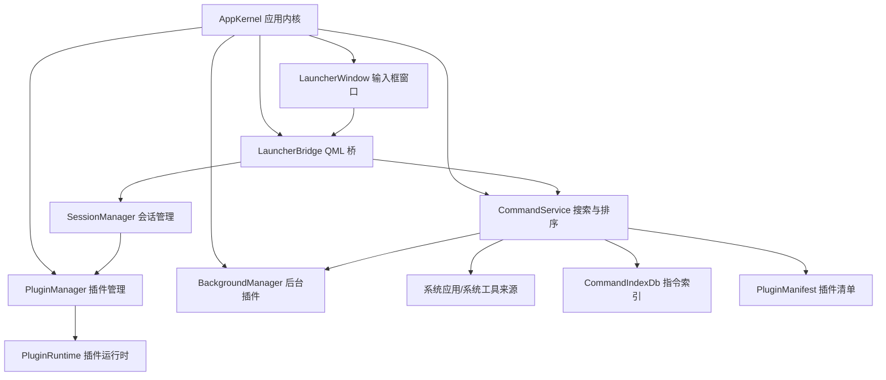
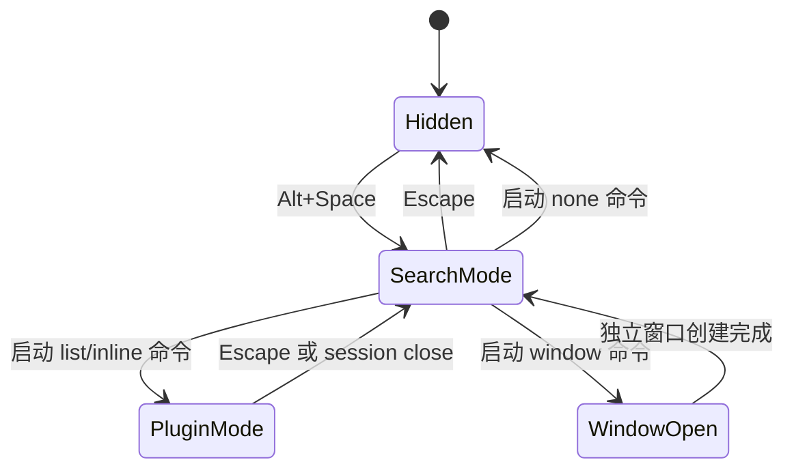

# Py Desktop Tools：类 uTools 架构设计文档

本文档是类 uTools 改造的架构设计参考。当前已经落地的代码状态、已删除旧文件和新手阅读路径，以 [改造实现说明](./refactor-implementation-notes.zh-CN.md) 为准。

后续 AI 或开发者实施时，可以参考本文档判断模块边界、插件生命周期和搜索指令模型；涉及当前文件路径和已完成迁移状态时，应优先核对实现说明。

当前实施策略：不兼容旧版插件注册表、旧版快速启动数据库和旧运行数据。可以复用现有功能页面、ViewModel、Service，但主链路应以新的 Manifest/Runtime/Session/Command 架构为准。

插件开发、独立插件包、前缀匹配和上下文推荐规则见：

- [插件开发文档](./plugin-development.zh-CN.md)

## 1. 产品定位

项目目标不是继续堆叠内置工具页面，而是构建一个常驻后台的桌面命令启动器。

目标形态：

- 应用启动后常驻后台。
- 用户按 `Alt+Space` 唤起一个输入框。
- 输入框默认展示快捷启动项。
- 快捷启动项包括插件、系统应用、系统工具、最近使用项、插件动态插入的命令。
- 用户输入文本后，全局搜索可用命令。
- 选中命令后才加载对应插件。
- 普通插件默认懒加载，未启动时不创建 ViewModel、不加载 QML、不初始化服务。
- 插件关闭后释放本次会话创建的资源。
- 支持常驻后台插件，例如剪切板监听。
- 支持简单列表模板插件。
- 支持输入框下方嵌入自定义 UI 的插件。
- 支持独立窗口插件，例如 API 测试工作台。

核心原则：

> 输入框是应用本体，插件是被输入框调度的能力。

## 2. 从 uTools 借鉴的关键概念

uTools 的核心不是“有很多插件”，而是“通过统一输入框调度一组功能指令”。本项目应借鉴这些设计：

- 全局搜索框是主交互入口。
- 插件不是一个页面，而是一个或多个功能指令的提供者。
- 一个插件可以贡献多个命令，例如 JSON 插件可贡献“格式化 JSON”“校验 JSON”“JSONPath 查询”。
- 命令可以通过关键词主动搜索，也可以通过输入内容智能匹配。
- 插件进入和退出有明确生命周期。
- 插件 UI 可以是无 UI、列表模板、自定义内嵌界面或独立窗口。
- 插件可以在运行时动态增加或删除命令。

参考的 uTools 官方文档：

- `plugin.json`、`features`、`cmds`：<https://www.u-tools.cn/docs/developer/information/plugin-json.html>
- 插件生命周期事件：<https://www.u-tools.cn/docs/developer/api-reference/utools/events.html>
- 动态指令：<https://www.u-tools.cn/docs/developer/api-reference/utools/features.html>
- 模板插件：<https://www.u-tools.cn/docs/developer/information/window-exports.html>

不要照搬 uTools 的 API 名称。应借鉴它的产品模型，再结合 Python、PySide6、QML 和当前代码实现。

## 3. 核心架构总览

运行时关系：



核心抽象：

- `CommandItem` 是最小可搜索、可启动单位。
- `PluginManifest` 是启动时可读取的轻量插件元数据。
- `PluginRuntime` 是真正的插件实现，只在需要时加载。
- `PluginSession` 表示一次插件启动后的活动会话。
- `LauncherWindow` 只负责输入、结果列表和当前插件承载区。

## 4. 术语

### Launcher

由 `Alt+Space` 唤起的全局输入窗口。它包含输入框、结果列表，以及可选的插件内容区域。

Launcher 不应该包含具体插件逻辑。

### Command

命令是可搜索、可匹配、可启动的最小单位。

示例：

- 打开 JSON 解析。
- 格式化当前剪贴板 JSON。
- 打开 API 测试窗口。
- 启动记事本。
- 打开任务管理器。
- 显示剪切板历史。
- 执行插件动态添加的快捷命令。

在启动器体验里，命令比插件更重要。

### Plugin

插件是命令和运行能力的提供者。一个插件可以贡献多个命令，也可以包含后台服务、列表 UI、自定义 QML 页面或独立窗口。

### Manifest

插件静态清单。Manifest 必须足够轻量，适合应用启动时全部读取。

Manifest 加载阶段禁止做这些事：

- 创建 ViewModel。
- 加载 QML。
- 初始化大型数据库。
- 启动线程、Timer、socket。
- 注册剪贴板监听。
- 发起网络请求。

### Runtime

插件真正的 Python 实现。只有命令被启动时，或者插件被声明为后台插件时，才加载 Runtime。

### Session

一次插件启动后的运行实例。Session 负责本次交互中创建的 ViewModel、QML Loader、窗口、信号连接、Timer、线程、socket 等资源。

### Background Plugin

常驻后台插件。例如剪切板插件需要应用启动后就监听剪贴板，但它的 UI 不应该随应用启动一起加载。

## 5. 推荐目录结构

目标结构：

```text
src/
  app/
    kernel/
      app_kernel.py
      app_context.py
    launcher/
      LauncherWindow.qml
      SearchResultItem.qml
      launcher_bridge.py
      launcher_state.py
    commands/
      command_item.py
      command_service.py
      command_index_db.py
      matchers.py
      ranker.py
      system_app_source.py
      system_tool_source.py
    plugins/
      manifest.py
      plugin_context.py
      plugin_manager.py
      plugin_runtime.py
      plugin_session.py
      session_manager.py
      background_manager.py
      list_template_model.py
    theme/
    ui/
  features/
    json_parser/
      manifest.py
      runtime.py
      JsonParserPage.qml
      view_model.py
    clipboard/
      manifest.py
      runtime.py
      service.py
      ClipboardList.qml
    api_test/
      manifest.py
      runtime.py
      ApiTestPage.qml
```

不需要一次性大搬家。可以保留现有目录，逐个功能迁移到目标结构。

## 6. 模块职责

### AppKernel

负责应用级生命周期：

- 初始化 `QApplication`。
- 初始化 QML engine。
- 注入全局 app/theme/launcher bridge。
- 注册全局热键。
- 初始化系统托盘。
- 创建 CommandService、PluginManager、SessionManager、BackgroundManager。
- 启动后台插件。
- 应用退出时清理后台服务。

AppKernel 不应该直接 import 具体 feature 的 ViewModel。

### LauncherBridge

暴露给 QML 的 QObject 桥。它应逐步替代当前的 `PluginRegistryBridge`。

职责：

- 暴露 `searchResults`。
- 接收输入框变化。
- 调用 CommandService 搜索。
- 启动选中的 CommandItem。
- 维护 Launcher 当前模式。
- 在插件模式下把输入转发给当前 Session。
- 处理 Escape 关闭插件或隐藏 Launcher。

LauncherBridge 不应该自己实现搜索算法，也不应该直接创建插件 ViewModel。

### CommandService

统一搜索、匹配、排序入口。

数据来源：

- 插件 Manifest 声明的静态命令。
- 插件运行时贡献的动态命令。
- 系统应用。
- 系统工具。
- 最近使用记录。
- 固定/收藏命令，如果以后添加。

CommandService 只产出 `CommandItem`，不负责加载插件 Runtime。

CommandService 也不应该硬编码每个插件的推荐规则。插件自己的关键词、前缀和上下文推荐规则应由 Manifest 声明；CommandService 只实现通用解析、打分和排序。

### CommandIndexDb

命令索引和排序缓存。可以从当前 `QuickStartDb` 演进而来。

职责：

- 使用次数。
- 最近使用时间。
- 系统应用快捷方式缓存。
- 图标缓存路径。
- 插件动态命令缓存。
- 未来的固定/收藏项。

注意：数据库是缓存和排序辅助，不是插件静态信息的唯一来源。插件静态命令应以 Manifest 为准。

### PluginManager

负责插件发现、Manifest 加载和 Runtime 懒加载。

职责：

- 启动时读取所有插件 Manifest。
- 按需 import 插件 Runtime。
- 创建 Runtime 实例。
- 在 Session 或后台服务需要时保留 Runtime。
- Session 关闭后释放 Runtime 引用。

PluginManager 不负责 QML 窗口和 Loader 管理。

### SessionManager

负责插件会话。

职责：

- 根据 CommandItem 启动插件。
- 请求 PluginManager 加载 Runtime。
- 调用 Runtime 的进入方法。
- 根据启动模式挂载 UI。
- 管理当前 inline/list session。
- 管理独立窗口 session。
- 转发输入变化。
- 关闭 session 并确保清理。

### BackgroundManager

负责常驻后台插件。

职责：

- 应用启动时加载 `activation=background` 的插件。
- 调用后台插件启动方法。
- 收集后台插件提供的动态命令。
- 应用退出时停止后台插件。

后台能力必须和 UI 会话分离。

## 7. 数据模型

### PluginManifest

建议模型：

```python
from dataclasses import dataclass, field
from typing import Literal

PluginActivation = Literal["lazy", "background"]
LaunchMode = Literal["none", "list", "inline_view", "window"]

@dataclass(frozen=True)
class PluginManifest:
    id: str
    name: str
    version: str
    description: str
    icon: str
    entrypoint: str
    activation: PluginActivation = "lazy"
    commands: list["CommandContribution"] = field(default_factory=list)
```

规则：

- `entrypoint` 指向 Runtime 工厂，例如 `features.json_parser.runtime:create_runtime`。
- Manifest 文件必须能在启动时快速 import。
- Manifest 不应隐式创建服务或 ViewModel。

### CommandContribution

插件在 Manifest 中声明的命令：

```python
@dataclass(frozen=True)
class CommandContribution:
    id: str
    title: str
    subtitle: str = ""
    icon: str = ""
    keywords: list[str] = field(default_factory=list)
    launch_mode: LaunchMode = "inline_view"
    input_mode: Literal["global", "plugin"] = "plugin"
    matchers: list["MatchRule"] = field(default_factory=list)
```

示例：

- JSON 插件：`json.format`、`json.validate`、`json.query`。
- 剪切板插件：`clipboard.history`。
- API 插件：`api.open`。

### CommandItem

运行时搜索结果，直接给 Launcher 渲染：

```python
@dataclass
class CommandItem:
    id: str
    title: str
    subtitle: str
    icon: str
    source: Literal["plugin", "plugin_command", "system_app", "system_tool", "dynamic"]
    launch_mode: LaunchMode
    plugin_id: str | None = None
    command_id: str = ""
    payload: dict = field(default_factory=dict)
    score: float = 0
    highlight_start: int = -1
    highlight_len: int = 0
```

所有 Launcher 结果都应该能表达为 `CommandItem`。

### PluginRuntime

建议协议：

```python
class PluginRuntime:
    def on_enter(self, ctx: "PluginContext", action: "PluginAction") -> "PluginSession":
        ...

    def on_exit(self) -> None:
        ...

    def get_dynamic_commands(self) -> list[CommandContribution]:
        return []
```

后台插件可以扩展：

```python
class BackgroundPluginRuntime(PluginRuntime):
    def on_background_start(self, ctx: "PluginContext") -> None:
        ...

    def on_background_stop(self) -> None:
        ...
```

### PluginSession

建议协议：

```python
class PluginSession:
    launch_mode: LaunchMode

    def create_qml_context(self) -> dict[str, object]:
        return {}

    def qml_page(self) -> str:
        return ""

    def list_model(self) -> list[dict]:
        return []

    def on_input_changed(self, text: str) -> None:
        ...

    def on_list_item_selected(self, item_id: str) -> None:
        ...

    def on_list_item_action(self, item_id: str, action_id: str) -> list[dict]:
        ...

    def close(self) -> None:
        ...
```

所有资源清理都必须进入 `close`。

## 8. Launcher 状态机

Launcher 只有两个主状态。

### SearchMode

默认状态。

- 输入文本交给 `CommandService.search(text)`。
- 结果列表展示全局命令。
- 回车启动当前选中命令。
- Escape 隐藏 Launcher。

### PluginMode

当用户启动 `list` 或 `inline_view` 命令后进入。

- 输入文本交给当前 `active_session.on_input_changed(text)`。
- 输入框下方由当前插件 session 控制。
- 列表模板里的行内按钮交给 `active_session.on_list_item_action(...)`。
- Escape 关闭当前 session，回到 SearchMode。
- Launcher 隐藏时，默认关闭非后台 session，除非 session 明确支持隐藏保活。

状态流：



## 9. 启动模式

### none

无 UI。执行后直接结束。

适用：

- 打开系统应用。
- 执行系统命令。
- 复制文本。
- 插件的一次性动作。

### list

使用通用列表模板，显示在输入框下方。

适用：

- 轻量剪切板历史或最近文件。
- 最近文件。
- 简单搜索结果。
- 应用启动列表。

插件只提供数据、选择行为和行内动作，视觉模板由 Launcher 统一提供。

### inline_view

在输入框下方加载插件自定义 QML。

适用：

- JSON 解析。
- 二维码生成。
- 图片压缩。
- 小型工具面板。

插件只在 session 生命周期内创建 ViewModel。

### window

打开独立窗口。

适用：

- API 测试。
- 抓包分析。
- 复杂设置页。
- 多面板工作台。

独立窗口关闭后应释放对应 session。

### background

这不是 UI 启动模式，而是插件激活模式。

后台插件可以同时提供 `list`、`inline_view`、`none` 等命令。

## 10. 插件生命周期

### 应用启动

应该做：

- 初始化 AppKernel。
- 初始化 QML engine。
- 加载所有插件 Manifest。
- 从 Manifest 初始化命令索引。
- 加载系统应用和系统工具缓存。
- 启动后台插件。

不应该做：

- 创建所有插件 ViewModel。
- 加载所有插件 QML。
- 初始化所有插件数据库。
- 为懒加载插件创建 Timer、线程、socket。

### 命令启动

流程：

1. Launcher 调用 `SessionManager.launch(command_item, current_input)`。
2. SessionManager 判断是否需要插件 Runtime。
3. PluginManager 按 entrypoint import Runtime。
4. Runtime 收到 `on_enter(ctx, action)`。
5. Runtime 返回 PluginSession。
6. SessionManager 根据 `launch_mode` 挂载 UI 或执行命令。
7. CommandIndexDb 记录使用次数和最近使用时间。

### 输入转发

如果 Launcher 处于 PluginMode：

```text
输入框内容变化 -> active_session.on_input_changed(text)
```

此时不再执行全局搜索，除非 session 主动退出 PluginMode。

### Session 关闭

关闭时必须：

- 调用 `session.close()`。
- 断开 session 创建的 Qt signals。
- 停止 session 创建的 Timer、线程、socket。
- 清空 QML Loader 或关闭独立窗口。
- 移除临时上下文对象。
- 如果 Runtime 没有被后台服务或其他 session 使用，则释放引用。

### “卸载”的定义

Python 中很难可靠地真正卸载模块。第一版不要依赖 `sys.modules` 删除。

本项目中“卸载插件”定义为：

- 没有活跃 Runtime 实例。
- 没有活跃 ViewModel/QObject 引用。
- 没有 session 创建的 Timer、线程、socket、文件监听、剪贴板监听。
- 没有 QML Loader 或 Window 持有插件对象。
- 没有未关闭的数据库连接。

## 11. 搜索与排序

默认结果应合并这些来源：

- 插件静态命令。
- 插件动态命令。
- 系统应用。
- 系统工具。
- 最近使用。
- 高频使用。
- 未来可能加入的固定/收藏项。

排序因素：

- 标题精确匹配。
- 标题前缀匹配。
- 标题包含匹配。
- 关键词匹配。
- 中文拼音匹配。
- 拼音首字母匹配。
- 插件智能匹配规则。
- 使用次数。
- 最近使用时间。
- 固定项加权，如果以后实现。

推荐行为：

- 无输入时展示快捷启动项，按固定项、使用频率、最近使用、默认顺序排序。
- 有输入时展示最佳匹配。
- PluginMode 下输入内容由插件接管，不跑全局搜索。

## 12. 智能匹配规则

除了关键词搜索，还应支持类似 uTools 的智能匹配。

智能匹配规则由插件在 Manifest 中声明，核心应用统一执行。不要为了某个插件在 `CommandService` 中写专属分支。

建议匹配类型：

```python
MatchType = Literal[
    "keyword",
    "regex",
    "text",
    "url",
    "file",
    "image",
    "json",
    "clipboard"
]
```

示例：

- JSON 插件匹配 `{...}` 或 `[...]` 文本。
- QR 插件匹配 URL 或普通文本。
- 图片压缩插件匹配图片文件路径。
- 剪切板插件匹配空输入或剪贴板内容。

还应支持文字前缀，例如：

```text
json {"foo": 1}
qr https://example.com
img D:\demo\a.png
api https://example.com/users
```

前缀、关键词和上下文 matcher 都属于插件声明，排序优先级建议：

```text
明确前缀命中 > 明确关键词/标题搜索 > 输入内容类型推荐 > 剪切板内容类型推荐 > 使用频率
```

第一版可以只实现 `prefixes`、`json`、`url`、`image`、`image_file` 和少量文本判断。

## 13. 后台插件设计

以剪切板插件作为参考。

不推荐：

```text
应用启动 -> 创建 ClipboardViewModel -> 加载 ClipboardPage.qml -> 启动监听
```

推荐：

```text
ClipboardBackgroundRuntime
  应用启动时加载
  监听剪切板变化
  写入 clipboard.db 和 clipboard_settings
  保存图片资产到 data/clipboard_assets/images
  可贡献动态命令和快捷键配置，但剪切板第一版只保留一个主入口

ClipboardInlineSession
  用户打开剪切板命令时加载
  读取/搜索 clipboard.db
  输入框内容变化时过滤文本/图片/文件历史
  输入框上下键移动选中项，回车复制当前选中项
  提供文本详情、文件名/路径展示、图片缩略图和大图预览
  提供置顶、删除、重新复制和设置动作
  用户退出后释放 UI 和 ViewModel
```

这样既能常驻监听，又不会让 UI 和插件页面提前加载。

## 14. QML 集成规则

应避免给每个插件全局注入 context property。

当前需要逐步淘汰的模式：

```python
ctx.setContextProperty("jsonParserVm", JsonParserViewModel())
ctx.setContextProperty("apiTestVm", ApiTestViewModel())
```

目标模式：

- 全局 QML context 只暴露稳定对象：
  - `app`
  - `launcherBridge`
  - `theme`
- 插件 session 只在激活期间提供临时对象。
- inline 插件由 session 管理 Loader。
- window 插件由 session 管理独立窗口。

如果 QML 动态注入 context 不方便，可以做一个 `PluginViewHost` QObject，统一暴露当前 session 的属性和 ViewModel。

## 15. 错误处理

插件失败不能拖垮 Launcher。

规则：

- Manifest 加载失败：禁用该插件并记录错误。
- Runtime 加载失败：展示错误提示，回到 SearchMode。
- Session 创建失败：回到 SearchMode。
- Session 关闭失败：记录错误，但 Launcher 必须恢复可用。
- 后台插件失败：只禁用该后台插件。

## 16. 后续 AI 实施约束

后续改代码时必须遵守：

- 不要在 `app.main` 中新增插件 ViewModel 的启动时创建。
- 不要让 LauncherWindow 直接依赖具体 feature。
- 不要让 CommandService 创建插件 Runtime。
- 不要把业务逻辑写进 QML，如果可以放到 ViewModel 或 Service。
- 不要让后台服务依赖 UI session。
- 搜索优先读取 Manifest 和索引，不要靠启动插件获得搜索项。
- 插件 Runtime import 必须经过 PluginManager。
- 每个 Session 必须有明确 cleanup。
- 新迁移的插件要验证搜索、启动、输入转发、关闭释放。

## 17. 迁移计划

### 阶段 1：建立新核心模块

先新增模块，不急着删除旧代码：

- `app.commands.command_item`
- `app.commands.command_service`
- `app.commands.command_index_db`
- `app.plugins.manifest`
- `app.plugins.plugin_manager`
- `app.plugins.session_manager`
- `app.launcher.launcher_bridge`

旧的 `PluginRegistryBridge` 可以先保留，等新桥接稳定后替换。

### 阶段 2：启动时只加载 Manifest

目标：

- 插件启动时只加载 Manifest。
- 不再启动时调用所有插件的 `create_view_model()`。
- 从 Manifest 初始化命令索引。
- 暂时保留现有 QML 页面，逐个插件迁移。

### 阶段 3：迁移第一个懒加载插件

建议先迁移 `json_parser`。

原因：

- 逻辑小。
- 没有后台常驻。
- 适合验证 `inline_view`。

预期结果：

- JSON 命令来自 Manifest。
- 选中命令后才加载 `JsonParserRuntime`。
- Runtime 创建 `JsonParserViewModel`。
- Launcher 进入 PluginMode。
- 输入变化转发给 JSON session。
- Escape 关闭 session 并释放 ViewModel。

### 阶段 4：迁移第一个后台 + 列表插件

迁移 `clipboard`。

预期结果：

- 后台服务应用启动时加载。
- 剪切板 UI 不随应用启动加载。
- 剪切板命令打开 Launcher 下方的嵌入式窗口。
- 输入内容过滤剪切板历史。
- 选择列表项后复制文本、图片或文件。
- 列表项支持置顶和删除。
- 剪切板设置支持记录类型、过滤规则和快捷键配置。
- 搜索结果里只保留一个剪切板入口。

当前状态：

- 已完成后台服务和 UI ViewModel 分离。
- 已完成 `BackgroundManager` 启动/停止后台插件。
- 已完成剪切板 UI 懒加载并复用后台服务。
- 已完成通用 `list` 模板。
- 剪切板已迁移为 `background + inline_view` 插件，不再使用旧专用 `ClipboardPage.qml`。
- 已完成 Launcher 输入框到剪切板历史过滤的转发。
- 已收敛剪切板入口，后台插件不再额外注册剪切板动态命令。
- 已完成剪切板文本、图片、文件三类历史。
- 已完成剪切板键盘选择/回车复制、文件名展示和图片预览。
- 已完成剪切板置顶、删除、过滤配置和快捷键配置。

### 阶段 5：系统来源统一成 CommandSource

迁移系统应用和系统工具：

- `SystemAppSource`
- `SystemToolSource`
- 图标提取和缓存。
- 应用重新扫描策略。

所有系统结果统一转成 `CommandItem`。

### 阶段 6：迁移窗口插件

迁移重型插件：

- `api_test` 作为 `window`。
- `packet_capture` 作为 `window`，但真实抓包能力另行设计。
- `app_launcher` 可考虑改成 `list` 或 `window`。

### 阶段 7：移除旧注册体系

当主要插件迁移完成：

- 删除启动时全量 ViewModel 注入。
- 删除或改名旧 `PluginRegistryBridge`。
- 将 `QuickStartDb` 演进/改名为 `CommandIndexDb`。
- 更新 README。
- 移除旧 smoke 脚本，改用静态检查和手动启动验证。

### 阶段 8：插件动态命令

目标：

- 插件 Runtime 可以在运行时向启动器贡献命令。
- 后台插件可以根据自身状态注册命令。
- 启动器搜索时合并 Manifest 固定命令和动态命令。
- 启动动态命令时传递 `plugin_id`、`command_id`、`payload` 给 Runtime。

当前状态：

- 已完成 `DynamicCommandRegistry`。
- 已完成 `DynamicCommand` 模型。
- 已完成 `LauncherBridge.pluginCommandLaunched`。
- 已完成 `CommandService` 合并动态命令搜索。
- 剪切板后台插件曾用于验证动态命令链路；当前产品形态要求剪切板只有一个入口，所以已移除剪切板动态命令。

### 阶段 9：应用自维护命令

目标：

- 应用自身也能提供启动器命令，例如重启、退出、打开设置。
- 这些命令走统一搜索体验，但执行逻辑由 AppKernel/main 层处理。

当前状态：

- 已完成 `重启应用` 系统命令。
- 启动器搜索 `重启应用/restart/reload` 可触发快速重启。
- 托盘菜单也提供 `重启应用`。
- 重启实现位于 `src/app/app_relauncher.py`。

## 18. 当前项目迁移备注

当前代码中需要特别注意：

- `src/app/main.py` 现在会 import 所有插件并创建所有 ViewModel，这与懒加载目标冲突。
- 当前 `PluginMeta.mode` 只有 `independent` 和 `mixed`，应替换为 `none`、`list`、`inline_view`、`window`。
- `QuickStartDb` 已经有统一搜索表、拼音搜索、使用频率、系统命令和应用缓存，可以继续演进。
- `PluginRegistryBridge` 已经承担 QML 搜索/启动入口，可以演进为 `LauncherBridge`。
- `clipboard` 应作为后台插件样板。
- `api_test` 更适合作为独立窗口插件。
- `packet_capture` 当前是 mock 数据，不应被视为真实抓包完成态。
- README 和验证说明应随迁移同步更新；旧 `tools/feature_smoke.py` 已移除。

## 19. 初始插件分类建议

| 插件 | 激活模式 | 启动模式 | 说明 |
| --- | --- | --- | --- |
| JSON 解析 | lazy | window | 双栏编辑/结果视图，更适合独立窗口。 |
| 剪切板 | background | inline_view | 后台监听 + 懒加载嵌入 UI，Launcher 输入框过滤历史，页面内集中管理详情和设置。 |
| 图片压缩 | lazy | inline_view | 自定义 QML。 |
| 下载工具 | lazy/background | window | 当前先做窗口，后续任务应迁到后台 service。 |
| 二维码 | lazy | inline_view | 自定义 QML。 |
| API 测试 | lazy | window | 重型工作台。 |
| 软件快速启动 | lazy | list | 复用 Launcher 输入框过滤并启动应用。 |
| 抓包工具 | lazy | window | 后续需要真实抓包设计。 |
| 系统设置 | lazy | inline_view | 应用级命令。 |
| 关于 | lazy | inline_view | 静态命令。 |

## 20. 待决策问题

实施前后需要逐步确认：

- inline/list 插件在 Launcher 失焦时是关闭，还是隐藏后下次恢复？
- window 插件是否在 Launcher 关闭后继续运行？
- 下载任务是否应该在插件 UI 关闭后继续运行？
- 动态命令是否跨重启持久化？
- 后续是否开放第三方插件市场，还是只支持本地自定义插件包？
- 插件是否长期保持进程内运行，还是未来支持独立进程隔离？

第一版建议：

- inline/list session 按 Escape 或 Launcher 隐藏时关闭。
- window 插件独立运行到窗口关闭。
- 后台能力由 background plugin 负责，不依赖 UI。
- 动态命令可持久化，但启动后要由所属插件校验。
- 暂时只做进程内插件，等架构稳定后再考虑进程隔离。

## 21. 每个插件迁移验收清单

每迁移一个插件，都应验证：

- Manifest 能快速 import。
- 命令能出现在全局搜索。
- 非后台插件 Runtime 不会在应用启动时 import。
- 启动命令后才创建 Runtime。
- Session 能收到初始输入。
- PluginMode 下后续输入会转发给 session。
- Escape 能关闭 session 并返回 SearchMode。
- 独立窗口关闭后释放 session。
- 使用次数会更新。
- 插件关闭后全局搜索仍可用。
- 插件加载失败不会导致应用崩溃。
